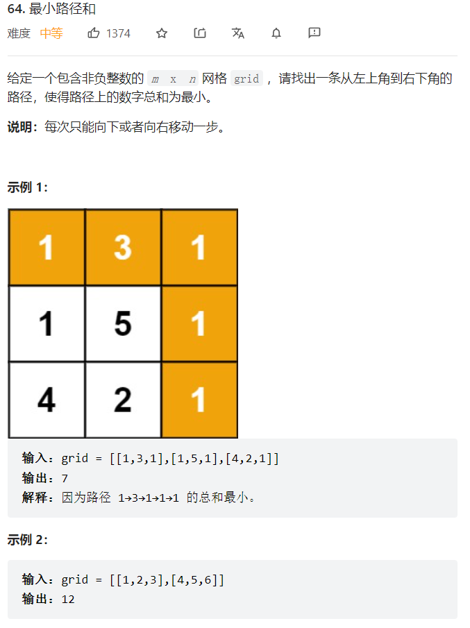
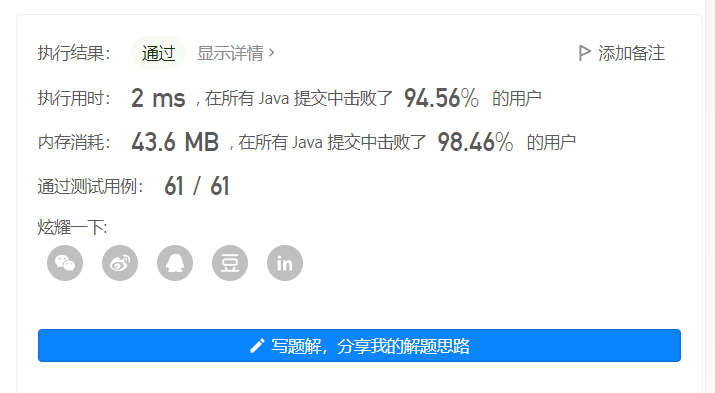

    

思路： 看到最小这两个字，和这种明显可以递推的图，要立马往动态规划方向靠   


```java
class Solution {
    public int minPathSum(int[][] grid) {
        //dp数组定义： 以当前节点结尾所能获得的最大数字总和
        int m = grid.length;
        int n = grid[0].length;
        int [][] dp = new int[m][n];
        //dp数组初始化：对一些特殊节点或者可以直接得出的进行初始化：很明显是第一行和第一列，路径和定死了，只能一条路走到底，因为题目要求只能向下或者向右走一步        
        dp[0][0] = grid[0][0];
        //初始化第一行：
        for(int j = 1; j < n; j++) {dp[0][j] = dp[0][j-1] + grid[0][j];}
        //初始化第一列  
        for(int i = 1; i < m; i++) {dp[i][0] = dp[i-1][0] + grid[i][0];}
        //dp遍历顺序:题目直接给了自左上至右下
        for(int i = 1; i < m; i++) {
           for(int j = 1; j < n; j++) {
            //dp递推公式： dp[i][j] = Math.min(dp[i-1][j],dp[i][j-1])+grid[i][j]   
                dp[i][j] = Math.min(dp[i-1][j],dp[i][j-1])+grid[i][j];
           }
        }
    //最终返回的肯定要是右下角，题目定义的      
    return dp[m-1][n-1];  
    }
}
```


     