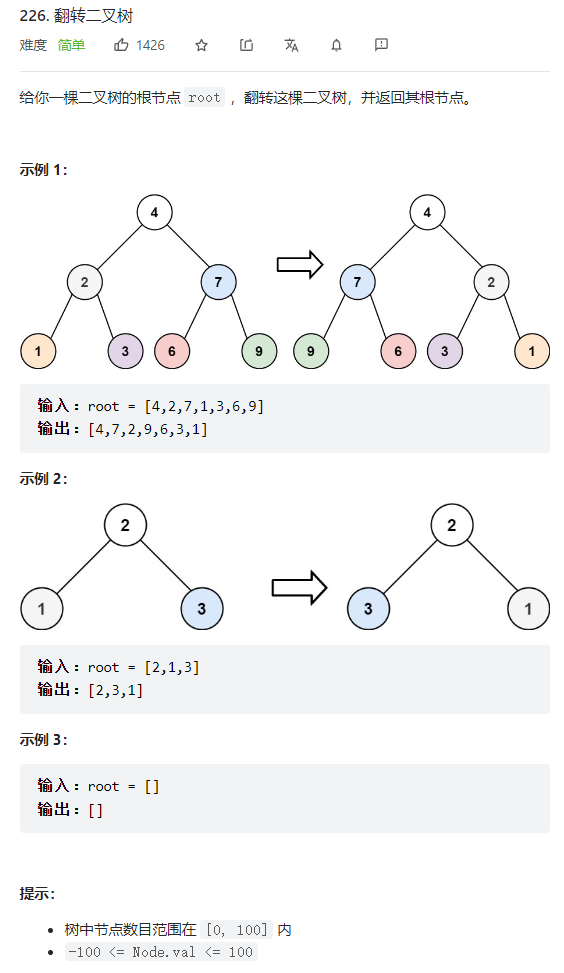
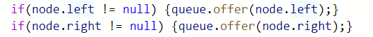
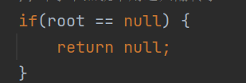

   


要注意的是，交换的是子树   
交换完一次就递归下去交换更深的子树   

递归写法
```java
/**
 * Definition for a binary tree node.
 * public class TreeNode {
 *     int val;
 *     TreeNode left;
 *     TreeNode right;
 *     TreeNode() {}
 *     TreeNode(int val) { this.val = val; }
 *     TreeNode(int val, TreeNode left, TreeNode right) {
 *         this.val = val;
 *         this.left = left;
 *         this.right = right;
 *     }
 * }
 */
class Solution {
    public TreeNode invertTree(TreeNode root) {
        //叶子节点就不用递归翻转了 
        if(root == null) {
            return null;
        }
        reverse(root);
        invertTree(root.left);
        invertTree(root.right);
        return root;
    }

    public void reverse(TreeNode root) {
        TreeNode temp = root.left;
        root.left = root.right;
        root.right = temp;
    }
}
```


迭代写法
树的迭代就是用队列写，这题翻转就是弹出两个节点然后交换就行了   

注意： 
迭代中的入队判空操作      

等同于递归的这一段判空代码        
    

```java
/**
 * Definition for a binary tree node.
 * public class TreeNode {
 *     int val;
 *     TreeNode left;
 *     TreeNode right;
 *     TreeNode() {}
 *     TreeNode(int val) { this.val = val; }
 *     TreeNode(int val, TreeNode left, TreeNode right) {
 *         this.val = val;
 *         this.left = left;
 *         this.right = right;
 *     }
 * }
 */
class Solution {
    public TreeNode invertTree(TreeNode root) {
        if(root == null) {return null;}
        Deque<TreeNode> queue = new LinkedList<>();
        queue.add(root);
        while(!queue.isEmpty()){
            int len = queue.size();
            //当层需要翻转的节点   
            while(len-- > 0) {
                TreeNode node = queue.poll();
                reverse(node);
                if(node.left != null) {queue.offer(node.left);}
                if(node.right != null) {queue.offer(node.right);}
            }
        }
        return root;
    }
    public void reverse(TreeNode root){
        TreeNode temp = root.left;
        root.left = root.right;
        root.right = temp;
    }
}
```