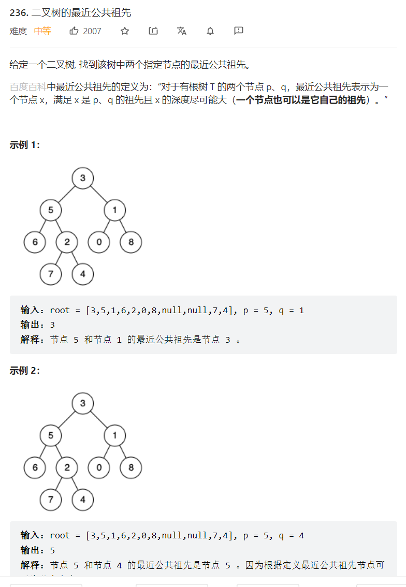

    

<https://leetcode.cn/problems/lowest-common-ancestor-of-a-binary-tree/>   

### 题目类型：   二叉树+回溯

### 解题思路：   
先向下递归查询到节点，如果是空就返回，如果是p或者q也返回，因为我们要找到p，q节点才能去知道他的祖先是哪个    

对左右节点的处理，在代码注释里
```java
/**
 * Definition for a binary tree node.
 * public class TreeNode {
 *     int val;
 *     TreeNode left;
 *     TreeNode right;
 *     TreeNode(int x) { val = x; }
 * }
 */
class Solution {
    public TreeNode lowestCommonAncestor(TreeNode root, TreeNode p, TreeNode q) {
        if(root == null || root == p || root == q) {return root;}
        TreeNode left =  lowestCommonAncestor(root.left,p,q);
        TreeNode right = lowestCommonAncestor(root.right,p,q);
        //情况1：都为空那就不用管了，说明p,q在其他子树上，直接返回null 
        if(left == null && right == null) {
            return null;
            //情况2：左边没有p,q,右子树下面有p,q,那最近公共祖先就在右子树，一样的，回溯会自己把最近的返回上来
        }   else if(left== null && right != null) {
            return right;
            //情况3：：右边没有p,q，左子树下面有p,q，那最近公共祖先就在左子树
        }else if(left != null && right == null) {            
            return left;
            //情况4：左右下面有p,q,那就返回最近的root,回溯的过程中是会一直带着离p,q最近的那个节点一直返回的
        }else {
            return root;
        }
    }
}
```

### 题目总结：  

首先看到这种，节点大概率是在下面的，就要想到先递归下去找到再回来  
也就是处理逻辑是在二叉树递归函数的后序遍历位置上，这里的后序遍历和遍历二叉树不同，而是递归的一种位置   

文中有一种特殊情况，就是p是q的最近公共祖先或者，q是p的最近公共祖先  
这种情况的处理代码就在方法体中的最开头  
```java
 if(root == null || root == p || root == q) {return root;}
        TreeNode left =  lowestCommonAncestor(root.left,p,q);
        TreeNode right = lowestCommonAncestor(root.right,p,q);
```
举个例子：  比如p的子树有q,那么我当前节点p还没拿到下面的递归函数，我就已经返回p了，那我p自然就是p，q的最近公共祖先了  