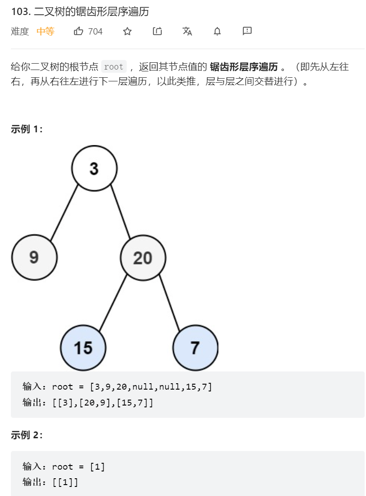

    


### 解题思路 
用一个双端队列去解决  


### 具体代码

第一种，BFS
```java
/**
 * Definition for a binary tree node.
 * public class TreeNode {
 *     int val;
 *     TreeNode left;
 *     TreeNode right;
 *     TreeNode() {}
 *     TreeNode(int val) { this.val = val; }
 *     TreeNode(int val, TreeNode left, TreeNode right) {
 *         this.val = val;
 *         this.left = left;
 *         this.right = right;
 *     }
 * }
 */
class Solution {
    Deque<TreeNode> queue = new LinkedList<>();
    List<List<Integer>> list = new ArrayList<>();
    public List<List<Integer>> zigzagLevelOrder(TreeNode root) {
        int x = 0;
        if(root == null) {return list;}
        queue.add(root);
        while(!queue.isEmpty()) {
            int len = queue.size();
            LinkedList<Integer> childList = new LinkedList<>();
            while(len-- > 0) {
                TreeNode curRoot = queue.poll();

                if(list.size() % 2 == 0) {
                    childList.add(curRoot.val);
                }else{
                    //根据索引插入到开头    
                    childList.add(0,curRoot.val);
                }
                if(curRoot.left != null) {queue.offer(curRoot.left);}
                if(curRoot.right != null) {queue.offer(curRoot.right);}
            }
            list.add(childList);
            x++;
        }
        return list;
    }
}    

```
第二种DFS
```java

```

### 题目总结  