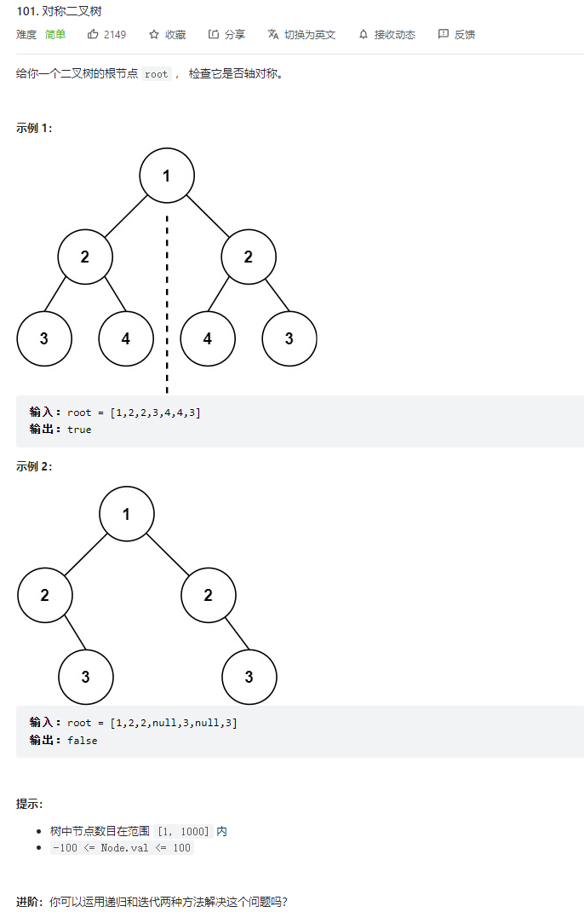

    


  

递归法:
```java
/**
 * Definition for a binary tree node.
 * public class TreeNode {
 *     int val;
 *     TreeNode left;
 *     TreeNode right;
 *     TreeNode() {}
 *     TreeNode(int val) { this.val = val; }
 *     TreeNode(int val, TreeNode left, TreeNode right) {
 *         this.val = val;
 *         this.left = left;
 *         this.right = right;
 *     }
 * }
 */
class Solution {
    public boolean isSymmetric(TreeNode root) {
        if(root == null) {return true;}
        return dfs(root.left,root.right);
    }
    public boolean dfs(TreeNode left,TreeNode right) {
        //都为空就返回true
        if(left == null && right == null){return true;}
        //一个为空一个不为空就是false 
        if(left == null || right == null) {return false;}
        //想满足对称需要左子树和右子树的值首先要相同，然后就是左子树的左节点和右子树的右节点匹配，左子树的右节点和右子树的左节点匹配   
        return (left.val == right.val && dfs(left.left,right.right) && dfs(left.right,right.left));
    }
}
```


迭代法:  树的迭代基本都是借助队列的    

判断条件和递归的思路一样

不同的是队列的使用，递归是传入左右两个节点参数  
队列就是先将左右两个节点进入队列  

然后递归中的递归参数传递，我们就用队列代替

```java
 /**
 * Definition for a binary tree node.
 * public class TreeNode {
 *     int val;
 *     TreeNode left;
 *     TreeNode right;
 *     TreeNode() {}
 *     TreeNode(int val) { this.val = val; }
 *     TreeNode(int val, TreeNode left, TreeNode right) {
 *         this.val = val;
 *         this.left = left;
 *         this.right = right;
 *     }
 * }
 */
class Solution {
    public boolean isSymmetric(TreeNode root) {
        if(root == null) {return true;}
        Queue<TreeNode> queue = new LinkedList<>();
        queue.offer(root.left);
        queue.offer(root.right);
        while(!queue.isEmpty()) {
            TreeNode leftNode = queue.poll();
            TreeNode rightNode = queue.poll();
            if(leftNode == null && rightNode == null) {continue;}
            if((leftNode == null || rightNode == null) || (leftNode.val != rightNode.val)) {
                return false;
            }
            queue.offer(leftNode.left);
            queue.offer(rightNode.right);
            queue.offer(leftNode.right);
            queue.offer(rightNode.left);
        }
        return true;
    }
}
```