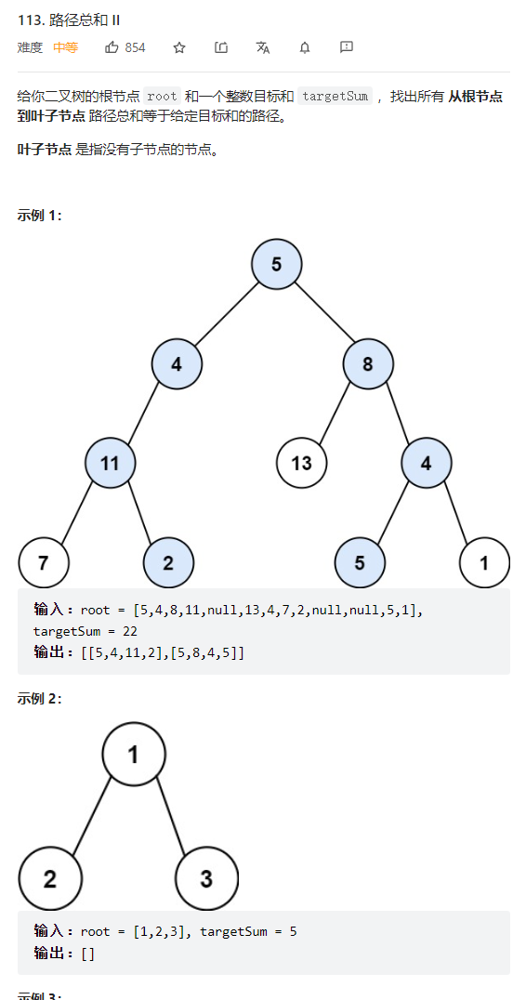

    


递归  
```java
/**
 * Definition for a binary tree node.
 * public class TreeNode {
 *     int val;
 *     TreeNode left;
 *     TreeNode right;
 *     TreeNode() {}
 *     TreeNode(int val) { this.val = val; }
 *     TreeNode(int val, TreeNode left, TreeNode right) {
 *         this.val = val;
 *         this.left = left;
 *         this.right = right;
 *     }
 * }
 */
class Solution {
    List<List<Integer>> list = new ArrayList<>();
    LinkedList<Integer> childList = new LinkedList<>();
    public List<List<Integer>> pathSum(TreeNode root, int targetSum) {
        if(root == null) {return list;}
            dfs(root,root.val,targetSum);
            return list;
    }
    public void dfs(TreeNode root,int sum,int targetSum) {
        childList.add(root.val);
        if(root.left == null && root.right == null && sum == targetSum) {
            list.add(new ArrayList<>(childList));
            return;
        }
        if(root.left!= null) {
            dfs(root.left,sum+root.left.val,targetSum);
            childList.removeLast();
        }
        if(root.right != null) {
            dfs(root.right,sum+root.right.val,targetSum);
            childList.removeLast();
        }
       
    }
}

```