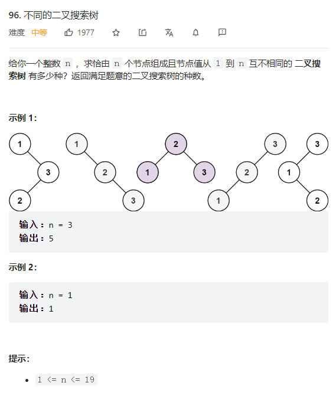

    


````java
class Solution {
    public int numTrees(int n) {
        //找规律：1-n，每个数字都有根节点的情况 
        int [] dp = new int[n+1]; 
        //这里解释下为什么要将dp[0]设置成1   
        /**从定义上来讲，空节点也是一棵二叉树，也是一棵二叉搜索树，这是可以说得通的。

从递归公式上来讲，dp[以j为头结点左子树节点数量] * dp[以j为头结点右子树节点数量] 中以j为头结点左子树节点数量为0，也需要dp[以j为头结点左子树节点数量] = 1， 否则乘法的结果就都变成0了。 */   
        dp[0] = 1;
        dp[1] = 1;
        for(int i = 2; i <= n; i++) {
            for(int j = 1; j <= i; j++) {
                //对于每个节点为根节点的情况来说，整棵树的种树=左子树的种树*右子树的种树
                //从1-3的图可知，左子树为j-1的情况，右子树为 i-j  
                    dp[i] += dp[j-1]*dp[i-j];
                }
            }
        return dp[n];
        }
    }

````