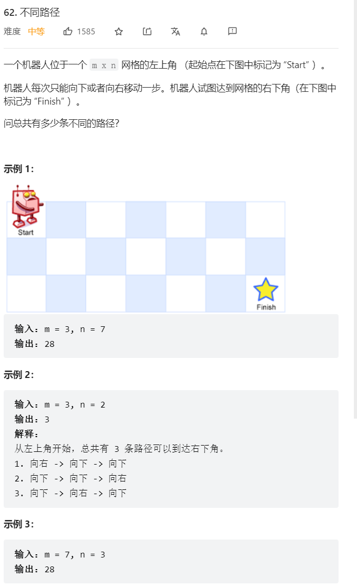

    

这种可以由前面的推出来的，首先都要想到动态规划   

```java
class Solution {
    public int uniquePaths(int m, int n) {
        //dp数组定义：经过当前格子能得到的不同路径 
        int[][] dp = new int[m][n];
        //dp数组初始化
        dp[0][0] = 1;  //从这里出发有一种路径  
        //由于只能向下或向右，所以第一行和第一列是可以初始化的 
        for(int i = 1; i < m; i++) {
            dp[i][0] = 1;
        }
        for(int j = 1; j < n; j++) {
            dp[0][j] = 1;
        }
        for(int i = 1; i < m; i++) {
            for(int j = 1; j < n; j++) {
                //dp递推公式，当前节点等于上面的加左边的不同路径相加  
                dp[i][j] = dp[i-1][j] + dp[i][j-1];
            }
        }
        return dp[m-1][n-1];
    }
}
```
时间复杂度O(m*n),空间复杂度O(m*n)