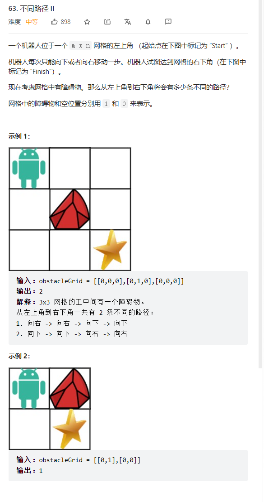

和不同路径1比起来就是多了障碍物而已   
障碍物就置0代表这个格子不能走就行  

```java
class Solution {
    public int uniquePathsWithObstacles(int[][] obstacleGrid) {
        int m = obstacleGrid.length;
        int n = obstacleGrid[0].length;
        //dp数组定义：到这个格子的路径  
        int [][] dp = new int[m][n];
        if(obstacleGrid[0][0] == 1) {return 0;}
        for(int i = 0; i < m; i++) {
            if(obstacleGrid[i][0] == 1) {break;}
            dp[i][0] = 1;
        }
        for(int j = 0; j < n; j++) {
            if(obstacleGrid[0][j] == 1) {break;}
            dp[0][j] = 1;
        }
        //dp递推顺序:从左上推右下
        for(int i = 1; i < m; i++) {
            for(int j = 1; j < n; j++) {
                //如果遇到路径，就置0，因为到这个格子之后也不能再走了，就是不能通过这个路径去推到别的格子了，设置0不影响下次推导过程    
                if(obstacleGrid[i][j] == 1) {
                    dp[i][j] = 0;
                }else{
                    //等于上面的和左边来的路径总和  
                    dp[i][j] = dp[i-1][j] + dp[i][j-1];
                }
            }
        }
        return dp[m-1][n-1];
    }
}
```