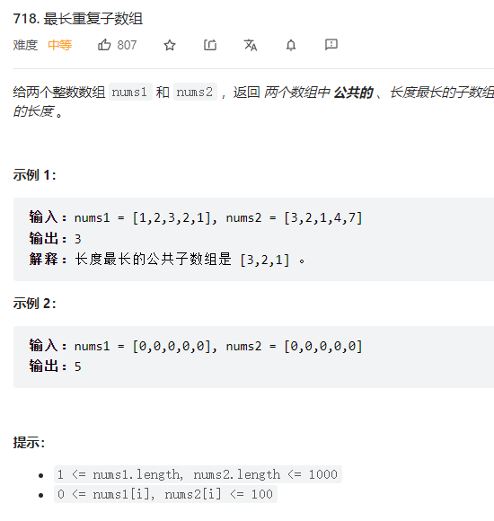
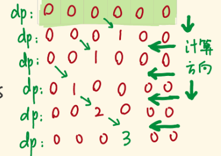

    

看到最长，看到重复，看到子字
先往动态规划上面靠   

这种两个数组的，先从二维dp开始想，面试官让你一维dp再去优化也会有一个思路  
上来就直接一维dp我是没那个能力     


A 、B数组各抽出一个前缀数组，单看它们的末尾项，如果它们俩不一样，则公共子数组肯定不包括它们俩。
如果它们俩一样，则要考虑它们俩前面的子数组「能为它们俩提供多大的公共长度」


二维dp写法
```java
class Solution {
    public int findLength(int[] nums1, int[] nums2) {
        //dp数组定义：以当前下标结束的重复子数组的最大长度  
        int [][] dp = new int[nums1.length+1][nums2.length+1];
        //dp初始化:都是0    
        int max = 0;
        for(int i = 1; i <= nums1.length; i++) {
            for(int j = 1; j <= nums2.length; j++) {
                if(nums1[i-1] == nums2[j-1]) {
                    dp[i][j] = dp[i-1][j-1] + 1;
                    max = Math.max(max,dp[i][j]);
                }
            }
        }
        return max;
    }
}
```  

时间复杂度O(m*n) 空间复杂度O(m*n)


降维思路：   

二维dp的时候我们的递推公式是从左上一直推到右下的   
对角线向下推导    
也就是后面的需要依赖上一行上一列的值  dp[i][j] = dp[i-1][j-1]+1   


如果我们要变为一维，也就是保留列，在递推的过程中，会涉及dp[j]覆盖问题    
因为我们dp[j]是要依赖dp[j-1]的值的，如果我们在上一轮循环中就改变了dp[i-1],那么会导致这一轮的dp[i]的值也不正确了   
为了防止被覆盖，所以要从右往左遍历，这样就会先用到上一轮的dp[i-1],而不会先覆盖dp[i-1]再计算dp[i]了   

注意事项：  二维的时候，我们不用刻意去指定0元素（代表这个下标之前没有重复子数组），而一维环境下对没有满足条件的下标   
我们需要用0覆盖，表示没有重复子数组    

      

一维dp写法
```java
class Solution {
    public int findLength(int[] nums1, int[] nums2) {
        //dp数组定义：以当前下标结束的重复子数组的最大长度  
        int [] dp = new int[nums2.length+1];
        //dp初始化:都是0    
        int max = 0;
        for(int i = 1; i <= nums1.length; i++) {
            for(int j = nums2.length; j >= 1; j--) {
                if(nums1[i-1] == nums2[j-1]) {
                    dp[j] = dp[j-1] + 1;      
                }else{
                    dp[j] = 0;
                }
                   max = Math.max(max,dp[j]);
            }
        }
        return max;
    }
}

```

时间： O(n*m) 空间O(m)  


滑动窗口写法  

思路：   

```java

```