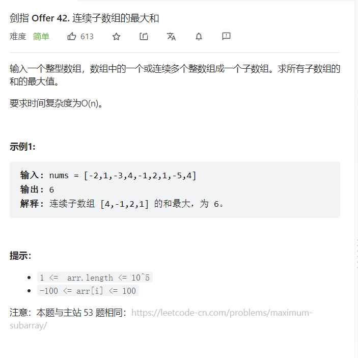

### 1 动态规划  
解题思路：  先搞清楚题目要求什么   

子数组里面的最大和   

怎么样才是最大和，那当然是有正数是最好的，负数越少越好，有正数开头的就不要用负数开头，前一个是正数了，后一个是负数那就肯定不是最大和了   

于是我们就搭建了我们的架构：   

这道题其实是贪心和dp都是一样的思路   

以正数开头的是最好的  
最大和一定是以正数结尾的   

如果找到正数的话那就和之前的和加上这个正数比较一下哪个大    
然后由于我们的子数组，中间可能会断开（由于负数问题），所以需要有个数记录下最大值   

其次，一个数组里面。最大和也可能是负数，可以整个数组都没有正数的   

```java
class Solution {
    public int maxSubArray(int[] nums) {
        //dp数组定义：以i为结尾的最大子数组的和  
        int max = nums[0];  
        int [] dp = new int[nums.length];
        dp[0] = nums[0];
        for(int i = 1; i < nums.length; i++) {
            //dp[i-1]就是上一个下标结尾的和的最大值  
            dp[i] = Math.max(dp[i-1] + nums[i],nums[i]);
            max = Math.max(max,dp[i]);
        }
        return max;
    }
}
```
时间复杂度:O(n) 空间复杂度 O(n)  

### 2 贪心做法  
贪心要没明白的是贪什么

大于0贪正数
小于0贪更小的负数   

```java
class Solution {
    public int maxSubArray(int[] nums) {
        int max = nums[0];
        int sum = nums[0];
        for(int i = 1; i < nums.length; i++) {
            if(sum <= 0) {
                sum = Math.max(sum,nums[i]);
            }else{
                sum += nums[i];
            }
                max = Math.max(sum,max);    
        }
        return max;
    }
}
```

时间复杂度 O(n) 空间复杂度 O(1)