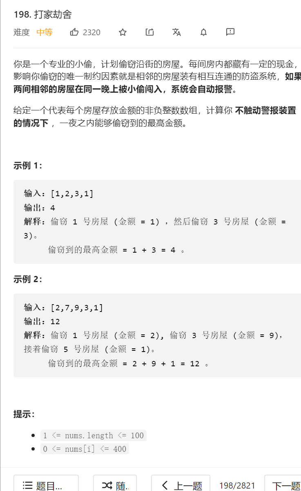

   


这道题的房子并不是循环连接起来的，所以这道题不用考虑第一个房子和最后一个房子，连在一起的过程        

就是不能偷相邻的房屋,所以i-2，要么就不偷i-1   


```java
class Solution {
    public int rob(int[] nums) {
        int length = nums.length;
        if(length == 1) {return nums[0];}
        //dp数组定义：截止这个下标下，能偷到的最大金额 
        int [] dp = new int[length+1];
        //dp数组初始化: 第一间的最大金额肯定是偷第一间   
        dp[0] = nums[0];
        //第二间屋子的最大值要么就是不偷，那就是第一间屋子的钱，要么就是偷第二间不偷第一间   
        dp[1] =  Math.max(nums[0],nums[1]);
        
        //dp遍历顺序:后面的是从前面的dp数组推起的   
        for(int i = 2; i < length; i++) {
            //屋子可以选择偷:dp[i-2]+nums[i]，也可以选择不偷：dp[i-1]
            dp[i] = Math.max(dp[i-2]+nums[i],dp[i-1]);
        }
        return dp[length-1];
    }
}
```