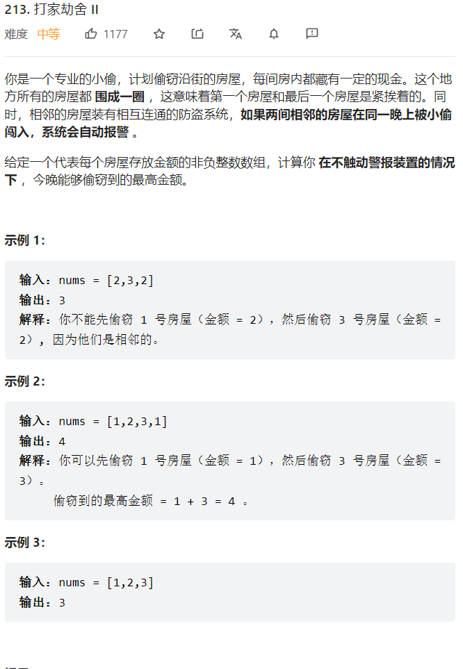

    


和打家劫舍1的不同点就是开头和结尾会连在一起，所以就有两种方案，一种能走到结尾，一种走到结尾的前一个


```java
class Solution {
    public int rob(int[] nums) {
        int n = nums.length;
        if(n == 1) {return nums[0];}
        if(n == 2) {return Math.max(nums[0],nums[1]);}
        int result1 = ans(nums,0,n-2);
        int result2 = ans(nums,1,n-1);
        return Math.max(result1,result2);
    }

    public int ans(int[] nums,int start,int end) {
        //dp数组定义:这个屋能得到的最多金额  
        int[] dp = new int[nums.length];
        dp[start] = nums[start];
        dp[start+1] = Math.max(nums[start],nums[start+1]);
        //dp遍历顺序：肯定是从开头到结尾
        for(int i = start+2; i <= end; i++) {
            //递推公式: 当前屋子的最大金额等于偷了上一个屋子了那这个屋子就不能偷了与上一个屋子没偷，那就是i-2屋子的钱加上自己这个屋子的钱，两者取最大值就行   
            dp[i] = Math.max(dp[i-1],dp[i-2]+nums[i]);
        }
        return dp[end];
    }
}
```

