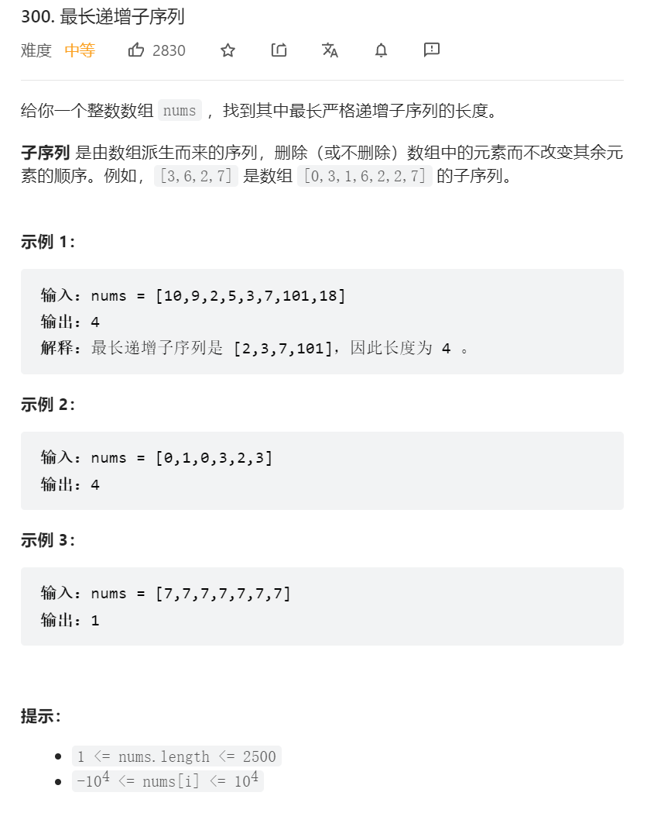
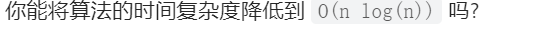

    


进阶：    
      

<https://leetcode.cn/problems/longest-increasing-subsequence/solution/zui-chang-shang-sheng-zi-xu-lie-dong-tai-gui-hua-2/>


dp做法
```java
class Solution {
    //子序列问题首先想到动态规划 
    public int lengthOfLIS(int[] nums) {
        //dp数组定义： 以当前下标为结尾的[0,i-1]的最长递增子序列   
        int [] dp = new int[nums.length+1];
        for(int i = 0; i < ) {
            for(int )
        }
    }
}
```