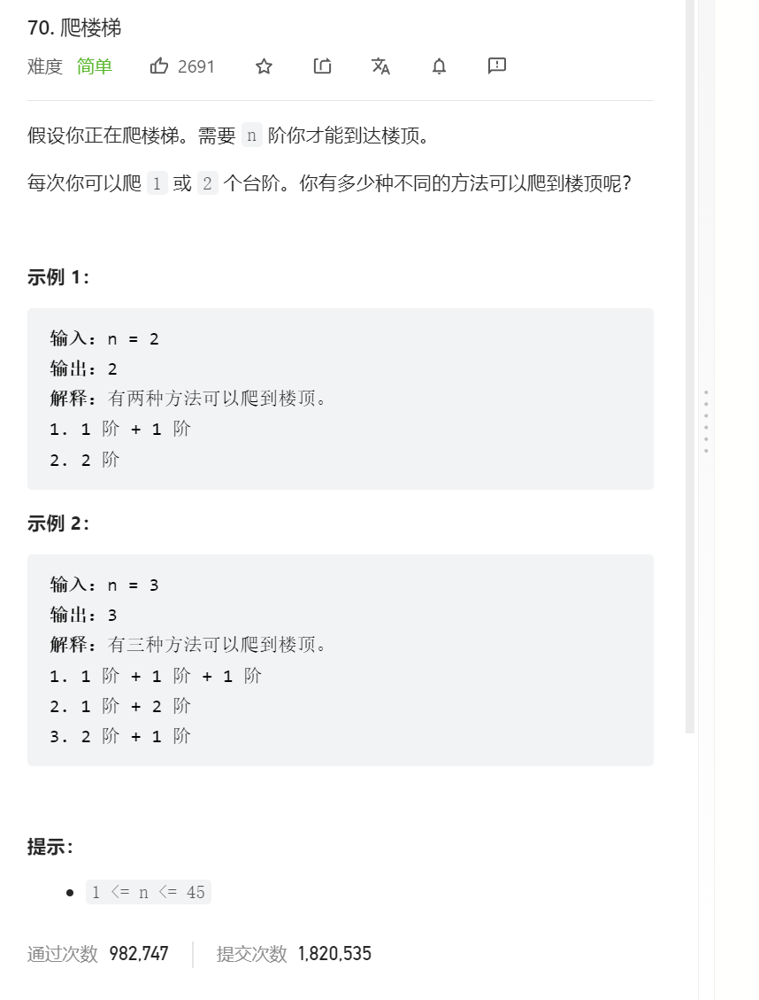

   

思路：因为踏上这层台阶，可以从i-1层跳一格上来，也可以从i-2层跳两格上来   
根据这种思想，又上面的阶层都是可以从下面的推导上来的，这种后面的可以从前面的推出，就是dp   


dp[i] = dp[i-1] + dp[i-2];

标准dp代码   
```java
class Solution {
    public int climbStairs(int n) {
        int[] dp = new int[n+1];
        if(n <= 2) {return n;}
        dp[1] = 1;
        dp[2] = 2;
        for(int i = 3; i <= n; i++) {
            dp[i] = dp[i-1] + dp[i-2];
        }
        return dp[n];
    }
}
```
时间:O(n),空间O(1)

dp思想加节省空间复杂度代码：
```java
class Solution {
    public int climbStairs(int n) {
        if(n <= 2) {return n;}
        int num1 = 1;
        int num2 = 2;
        int ans = 0;
        for(int i = 3; i <= n; i++) {
            ans = num1 + num2;
            num1 = num2;
            num2 = ans;
        }
        return ans;
    }
}
```

时间:O(n),空间O(1)