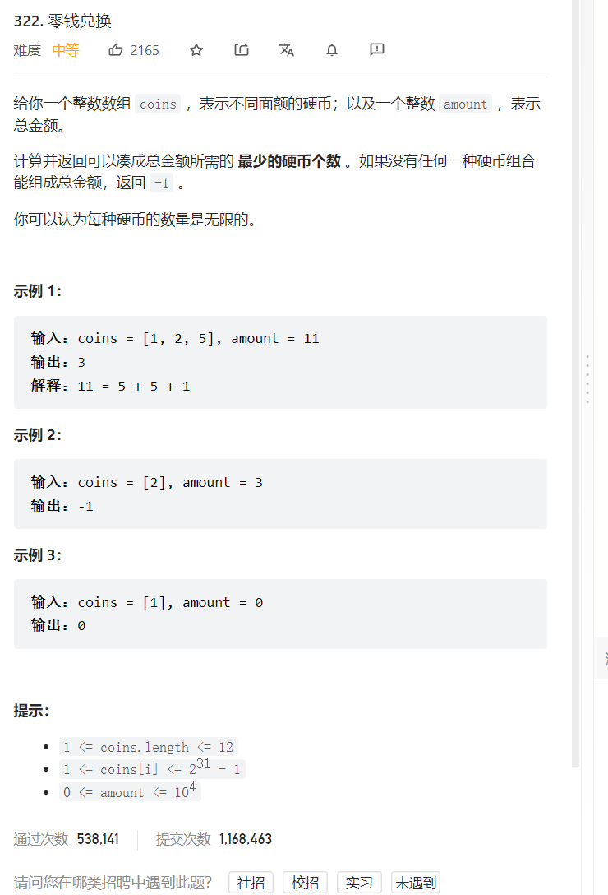

     


解题思路就是用完全背包的思想，因为看到了硬币数量无限   

那么是如何想到用动态规划做的呢，首先就是  

动态规划的一般形式就是求最值   
是运筹学中的一种最优化算法   
让你求什么最长递增子序列，最小编辑距离，都是动态规划求最值的思想      

动态规划过程中存在重叠子问题，所以如果运用了这些重复的数值，那我们效率自然是比穷举要好的   

```java
class Solution {
    public int coinChange(int[] coins, int amount) {
        //dp数组：凑成这个金额需要的最少硬币个数  
        int[] dp = new int[amount+1];  //答案是dp[amount]
        
        //看到要求最少，那过程中不用说了，肯定是需要Math.min(); 而我们每个 的初始值都是0，那肯定不行，所以我们先初始一波让他们初始值是最大值   
        Arrays.fill(dp,Integer.MAX_VALUE);
        //背包容量就是amount
        //物品价值就是硬币个数
        //没有金额，那就不用硬币，那就是0
        dp[0] = 0;  
        for(int i = 1; i <= amount; i++) {
            for(int j = 0; j < coins.length; j++) {
                if(i-coins[j] >= 0 && dp[i-coins[j]] != Integer.MAX_VALUE) {
    dp[i] = Math.min(dp[i-coins[j]] + 1,dp[i]);
                } 
            }
        }
        return dp[amount] == Integer.MAX_VALUE ? -1 : dp[amount];
    }
}
```