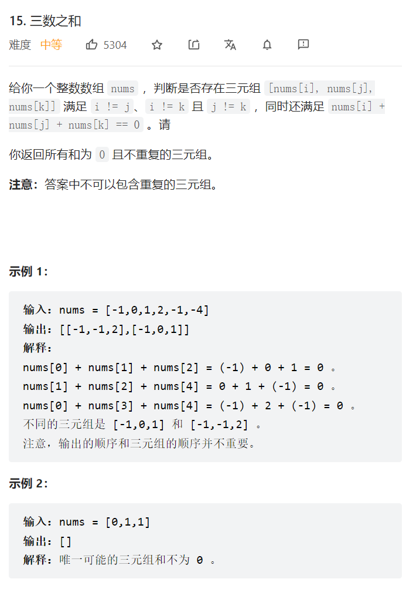

    

<https://leetcode.cn/problems/3sum/>   

这种题和四数之和都是一样的，都是用双指针
三数就是固定一个for循环，里面用左右指针做
四数就是固定两个for循环，里面用左右指针做  
  
记得做去重处理   

然后是Arrays.asList()可以快速将数组变为list   
```java
class Solution {
    List<List<Integer>> list = new ArrayList<>();
    public List<List<Integer>> threeSum(int[] nums) {
        int length = nums.length;
        Arrays.sort(nums);
        for(int i = 0; i < length-2; i++) {
            int left = i+1;
            int right = length-1;
            //去重
            if(i > 0 && nums[i] == nums[i-1]) {continue;}
            while(left < right) {
                int sum = nums[i] + nums[left] + nums[right];
                if(sum == 0) {
                    list.add(Arrays.asList(nums[i],nums[left],nums[right]));
                    //去重逻辑：移到最后一个重复的地方
                    while(left < right && nums[left] == nums[left+1]) {left++;}
                    while(left < right && nums[right] == nums[right-1]) {right--;}
                    //因为之前是刚刚好等于0，此时不管是单独的left++ 或是 right--都会使num不等于0，所以单独的移动左右指针没有意义
                    left++;
                    right--;
                }else if(sum > 0) {
                    right--;
                }else{
                    left++;
                }
            }
        }
        return list;
    }
}
```  

