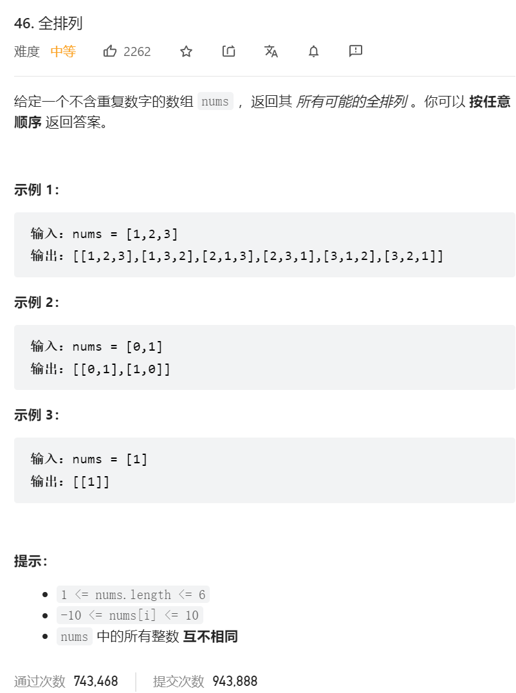
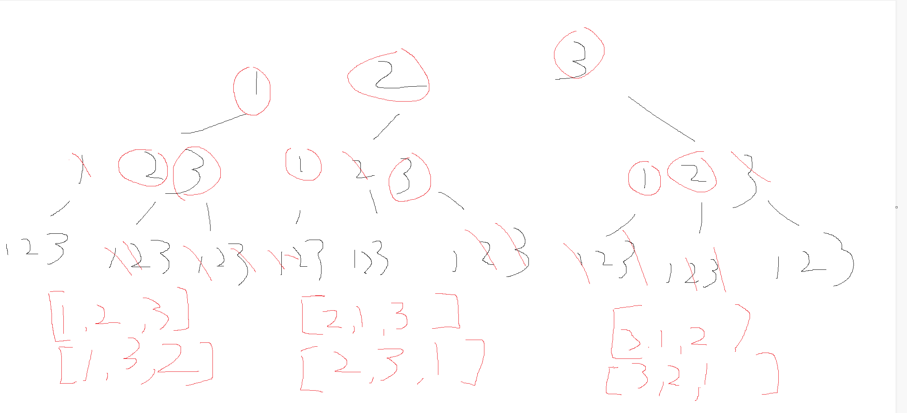

      

回溯过程树
    


看图，数组是无重复数字的，然后呢，全排列我们需要去除掉路径中已经选了的，所以需要一个used数组，可以选择int,也可以选择boolean类型的    

递归下去的时候要将沿途路径设置used ,回溯上来去同层的其他节点的时候需要把节点设置为未访问过以去其他子树遍历答案    

```java
class Solution {
    List<List<Integer>> list = new ArrayList<>();
    LinkedList childList = new LinkedList<>();
    public List<List<Integer>> permute(int[] nums) {
        int length = nums.length;
        backTraverse(nums,new int[length]);
        return list;
    }

    public void backTraverse(int[] nums,int [] used) {
        if(childList.size() == nums.length) {
            list.add(new ArrayList<>(childList));
            return;
        }
        for(int i = 0; i < nums.length; i++) {
            //没访问过   
            if(used[i] == 0) {
                childList.add(nums[i]);
                used[i] = 1;
                backTraverse(nums,used);
                childList.removeLast();
                used[i] = 0;
            }
        }
    }
}
```