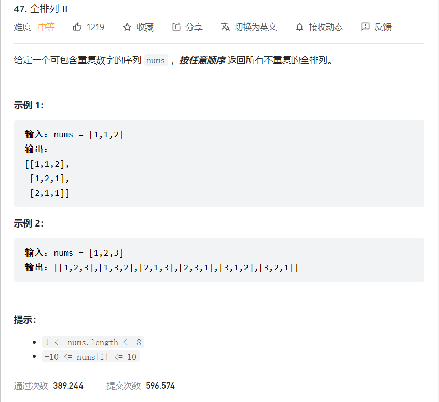

   


```java
class Solution {
    List<List<Integer>> list = new ArrayList<>();
    LinkedList<Integer> childList = new LinkedList<>();
    public List<List<Integer>> permuteUnique(int[] nums) {
        //去重思路：先排序因为要同树层是会有重复的    
        //同树层用排序去掉，同树层的重复不能要   
        //同树枝的用used数组去重   
        int[] used = new int[nums.length];
        Arrays.sort(nums);
        backTraverse(nums,used);
        return list;
    }

    public void backTraverse(int [] nums,int[] used) {
        //就是全排列的长度   
        if(childList.size() == nums.length) {
            list.add(new ArrayList(childList));
        }
        for(int i = 0; i < nums.length;i++) {
            //对同一树层来说，之前的used[i-1]肯定是0，因为不管怎么样，初始是0，就算为1，最后回溯也会变成0，所以used[i-1] == 0 就是树层去重的条件       
            //树枝去重和树层去重,只要有一个重复就跳过    
            //   ||左边是树枝去重，||右边是树层去重   
            if(used[i] == 1 || (i > 0 && nums[i] == nums[i-1] && used[i-1] == 0)) {
                continue;
            }
            used[i] = 1;
            childList.add(nums[i]);
            backTraverse(nums,used);
            used[i] = 0;
            childList.removeLast();
        }
    }
}
```