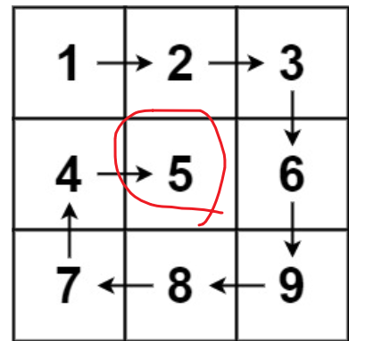
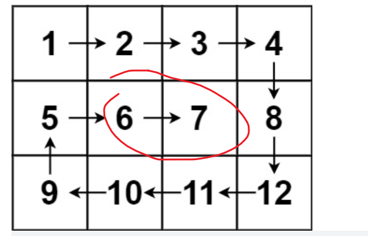

这道题和图的一些遍历题很像的  

都是边界问题，要注意好，i,j不要搞混了，自己定一个模板  
比如i就是横坐标，二维数组的第一个方框里面写的  
j是纵坐标   

从左到右（和从右到左）就是，定住i,移动j
从上到下（和从下到上）就是，定住j，移动i

要注意的一点是，边界重合是没事的，毕竟你还要处理 如下这种最中间那一行的数据
    
    

如果重合就退出循环的话，那就遍历不到了   

所以退出循环的条件是，左边界大于有边界或者上边界大于下边界   
```java
class Solution {
    List<Integer> list = new ArrayList<>();
    public List<Integer> spiralOrder(int[][] matrix) {
         int shangbianjie = 0;
         int xiabianjie = matrix.length-1;
         int zuobianjie = 0;
         int youbianjie = matrix[0].length-1;
         while(true) {
            //从左往右  
            for(int j = zuobianjie; j <= youbianjie; j++) {list.add(matrix[shangbianjie][j]);}
            shangbianjie++;
            if(shangbianjie > xiabianjie) {break;}
            //从上到下
            for(int i = shangbianjie;i <= xiabianjie; i++) {list.add(matrix[i][youbianjie]);}
            youbianjie--;
            if(zuobianjie > youbianjie) {break;}
            //从右往左
            for(int j = youbianjie; j >= zuobianjie; j--) {list.add(matrix[xiabianjie][j]);}
            xiabianjie--;
            if(shangbianjie > xiabianjie) {break;}
            //从下往上
            for(int i = xiabianjie; i >= shangbianjie; i--) {list.add(matrix[i][zuobianjie]);}
            zuobianjie++;
            if(zuobianjie > youbianjie) {break;}
         }
        return list;
    }
}
```