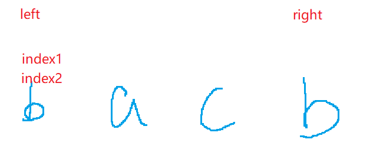

# 这题用滑动窗口配合哈希来做
这种最长字串，什么子串，都是可以想到滑动窗口的
```java
	class Solution {
    public int lengthOfLongestSubstring(String s) {
        int length = s.length();
        if(s == null || length == 0) {return 0;}
        int maxNum = 1;
        int left = 0;
        int right = 0;
        HashMap<Character,Integer> map = new HashMap<>(); 
        while(right < length){
            char c = s.charAt(right);
            if(map.containsKey(c)) {
                //第一种情况是在第一个位置上
                int index1 = left;
                //第二种情况是在中间的位置上    
                int index2 = map.get(c)+1;
                left = Math.max(index1,index2);
            }
            map.put(c,right);
            maxNum = Math.max(maxNum,right-left+1); 
            right++;
        }
        return maxNum;
    }
}
```

上述代码说的第一种情况:   此时新的窗口从left+1开始算    
    

上述代码说的第二种情况:   此时新的窗口就要从index2加1开始算了   
    
