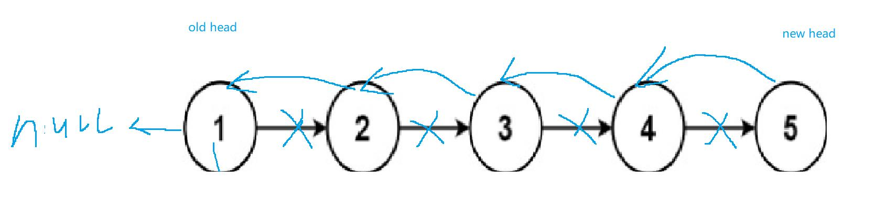

反转链表，用回溯来做，返回的时候尾节点是新的头节点，旧的头节点需要指向null

先递归到最后，最后回溯的过程去处理节点
 
```java
class Solution {
    public ListNode reverseList(ListNode head) {
        if(head == null) {return null;}
        //到尾节点了就返回这个反转的头节点    
        if(head.next == null) {return head;}
        ListNode newHead = reverseList(head.next);
        head.next.next = head;   
        head.next = null;
        //最后递归返回的肯定是新的头节点  
        return  newHead;
    }
}
```


