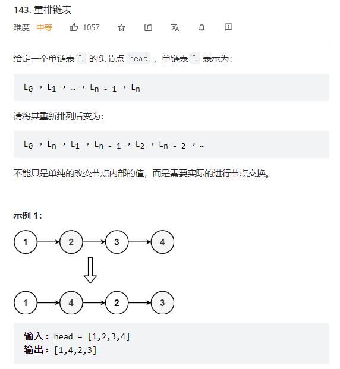

    
重排链表就是结合了反转链表加寻找链表的中间节点加合并链表的三种操作的组合   

```java
/**
 * Definition for singly-linked list.
 * public class ListNode {
 *     int val;
 *     ListNode next;
 *     ListNode() {}
 *     ListNode(int val) { this.val = val; }
 *     ListNode(int val, ListNode next) { this.val = val; this.next = next; }
 * }
 */
class Solution {
    //L0 -> Ln -> L1 -> Ln-1 -> L2 -> Ln-2 -> L3 -> Ln-3   


    public void reorderList(ListNode head) {
        if(head == null) {return;}
        ListNode midNode = findMidNode(head); 
        //反转右半边的节点，然后一个个插入到左边的空隙中
        ListNode RightNode = reverse(midNode.next);
        ListNode leftNode = head;
        ListNode leftNext;
        ListNode rightNext;
        //链表合并的操作，按照题意来连接就行了   
        while(RightNode != null) {
            leftNext = leftNode.next;
            leftNode.next = RightNode;
            leftNode = leftNext;
            rightNext = RightNode.next;
            RightNode.next = leftNode;
            RightNode = rightNext;
        }
        //注意，最后的时候要把我们的中间节点设置成null，因为我们之前的时候，midNode的next是没有断的，还是连着右边的节点  
        midNode.next = null;
    }
    

    //找到中间节点  
    public ListNode findMidNode(ListNode head) {
        ListNode slow = head;
        ListNode fast = head;
        while(fast != null && fast.next != null) {
            slow = slow.next;
            fast = fast.next.next;
        }
        return slow;
    }
    
    //反转中间节点后面的节点   
    public ListNode reverse(ListNode node) {
        if(node == null) {return null;}
        //尾节点   
        if(node.next == null) {return node;}
        ListNode newHead = reverse(node.next);
        node.next.next = node;
        node.next = null;
        return newHead;
    }

}
```
