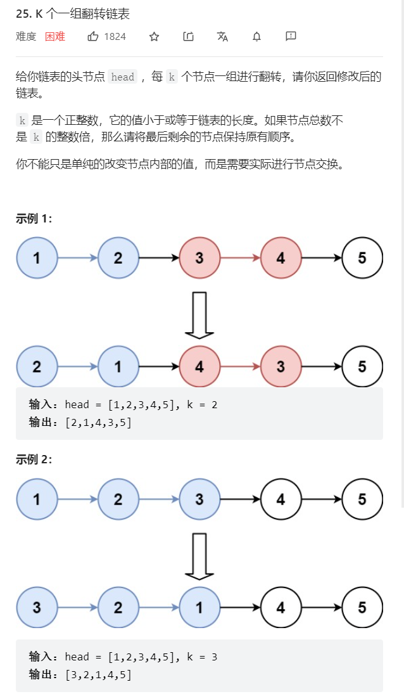

    

### 进阶： O(1)空间复杂度解决  

意思就是原地进行链表的翻转   
和反转链表差不多   


```java
/**
 * Definition for singly-linked list.
 * public class ListNode {
 *     int val;
 *     ListNode next;
 *     ListNode() {}
 *     ListNode(int val) { this.val = val; }
 *     ListNode(int val, ListNode next) { this.val = val; this.next = next; }
 * }
 */
class Solution {
    ListNode first;
    ListNode last;
    public ListNode reverseKGroup(ListNode head, int k) {
        if(head == null) {return null;}
        //首先我们需要记录下链表的长度 ,时间复杂度为O(n)
        ListNode lengthHead = head;
        ListNode ans = new ListNode(0,lengthHead);
        int length = Length(head);
        head = lengthHead;
        //判断我们需要操作的次数  
        int  count = length / k;
        //执行下面那么多次的反转     
        last = head;
        while(count-- > 0) {
            first = last;
            //首先保存初始节点
            reverse(first,1,k);
            first.next = last;
        }
        //如果最后还有剩余，就不需要管它了，把最后一次反转的节点，指向剩下的节点就行了
        return ans.next;
    }

    public int Length(ListNode head) {
        int sum = 0;
        while(head != null) {
            sum++;
            head = head.next;
        }
        return sum;
    }
    //翻转指定长度的链表,我们  
    public ListNode reverse(ListNode head,int curNum,int k) {
        if(head == null) {return null;}
        if(head.next == null) {return head;}
        if(curNum == k) {
            last = head.next;
            return head;
        }
        ListNode temp = reverse(head.next,curNum+1,k);
        head.next.next = head;
        head.next = null;
        return temp;
    }
}

```