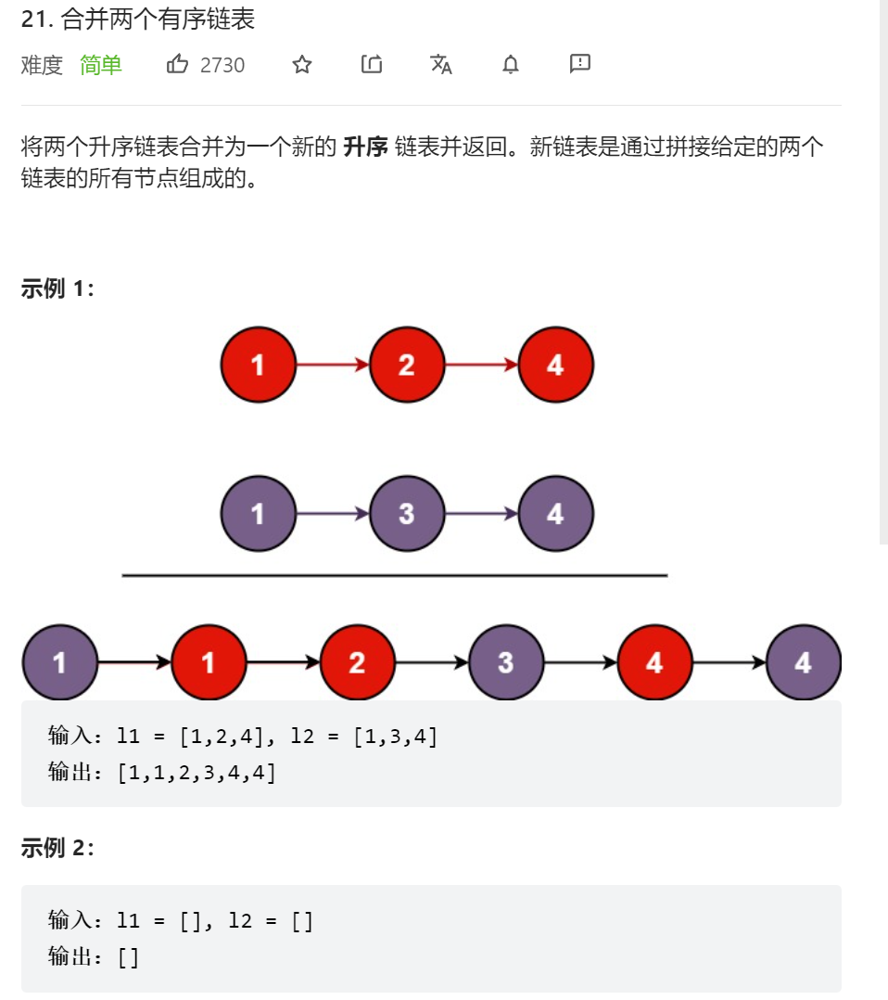

   


每次递归都减少一个节点   
list2.next = mergeTwoLists(list1,list2.next);      


```java
class Solution {
    public ListNode mergeTwoLists(ListNode list1, ListNode list2) {
        //1.首先是只要一个为空，直接就返回剩下的就行了，必定是有序的   
        if(list1 == null) {return list2;}
        if(list2 == null) {return list1;}
        //小的指大的   
        if(list1.val > list2.val) {
            list2.next = mergeTwoLists(list1,list2.next);
            return list2;
        }else{
            list1.next = mergeTwoLists(list1.next,list2);
            return list1;
        }
    }
}
```