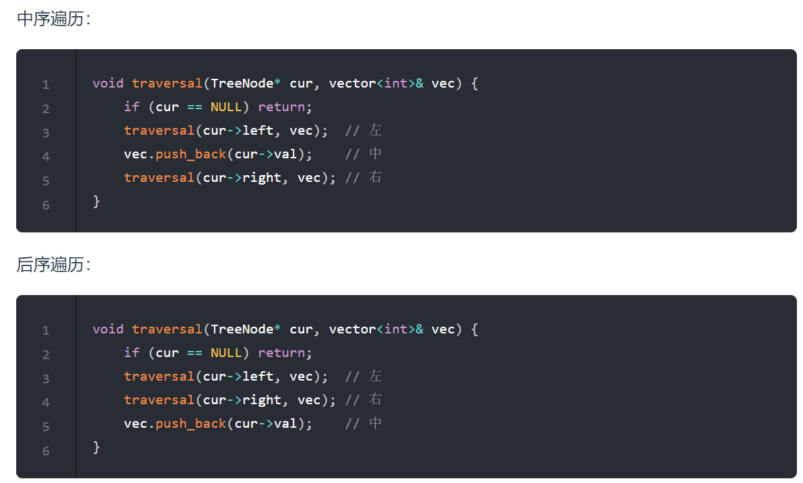
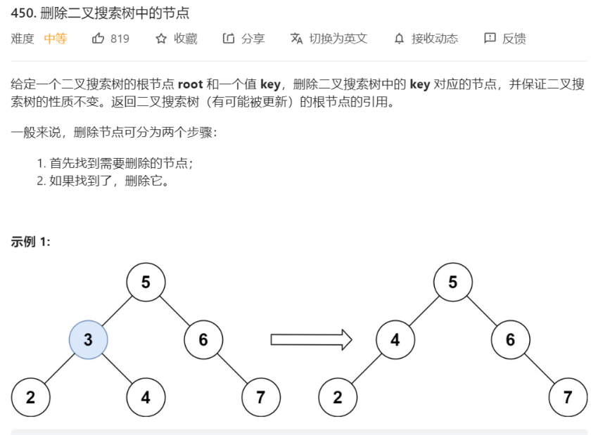
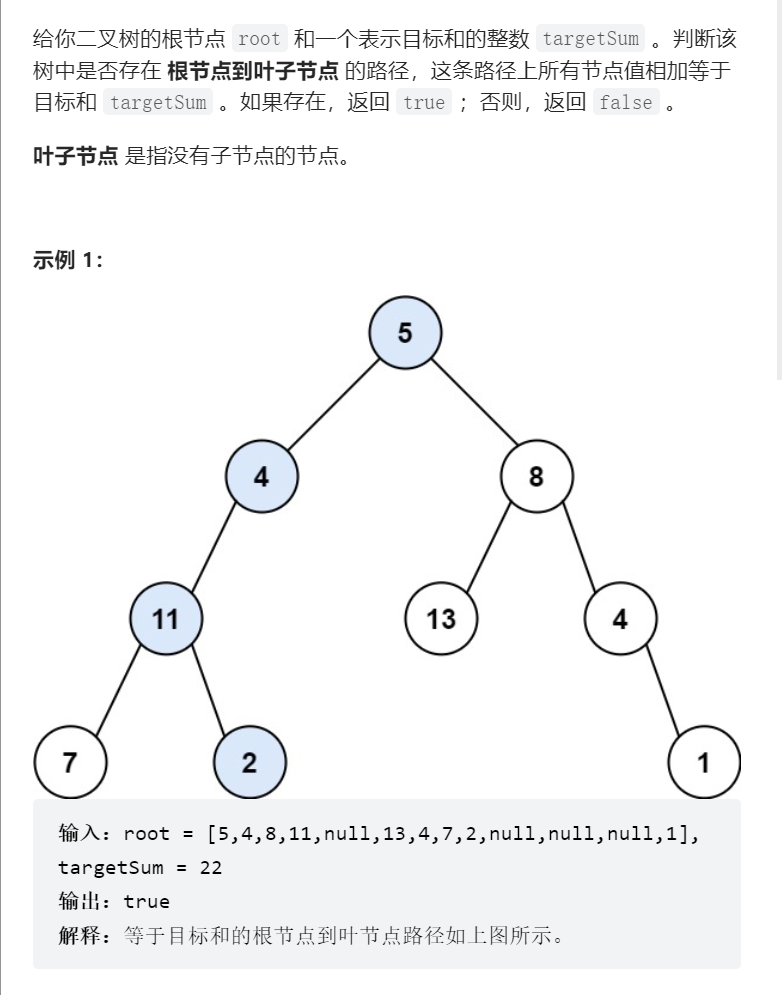
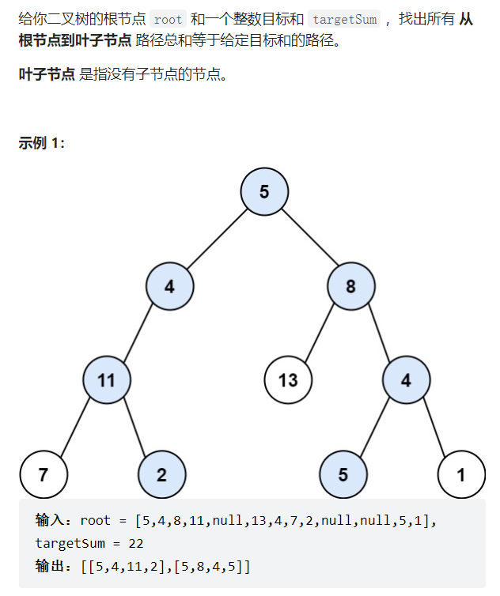
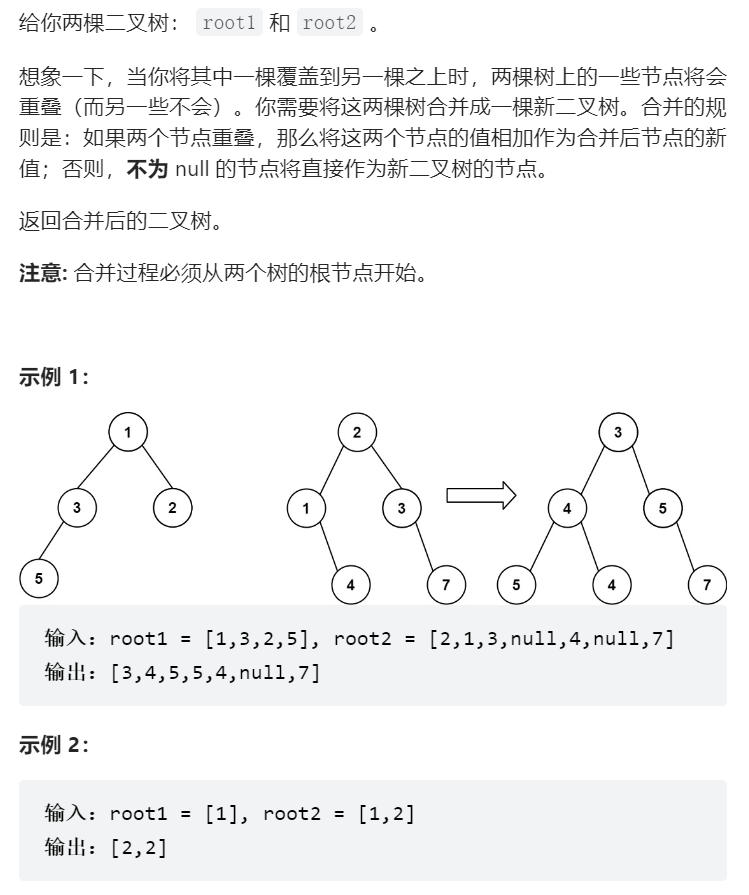
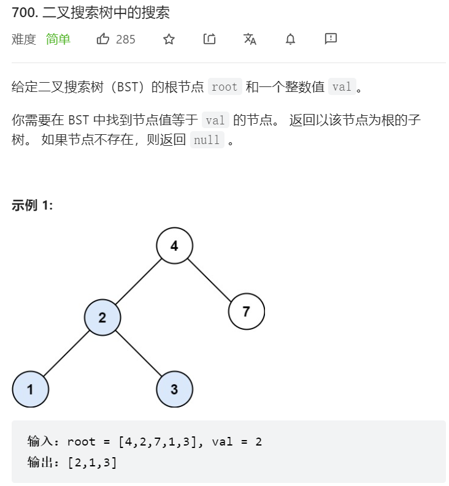

# 二叉树的数据结构  
```java
public TreeNode{
    TreeNode left;
    TreeNode right;
    int val;
    
    public TreeNode() {}
            
    public TreeNode(int val) {this.val = val;}
    
    public TreeNode(int val,TreeNode left,TreeNode right) {
        this.val = val;
        this.left = left;
        this.right = right;
    }        
    }

```
# 1. 二叉树的前中后序遍历  
### 递归实现
###### 前序遍历    
```java
class Solution {
    List<Integer> list = new ArrayList<>();
    
    public List<Integer> preorderTraversal(TreeNode root) {
        preorder(root);
        return list;
    }

    public void preorder(TreeNode root) {
        //递归终止条件  
        if(root == null) {
            return;
        }
        list.add(root.val);
        preorder(root.left);
        preorder(root.right);
    }
}
```
中和后只是递归改一下位置而已   
    

### 迭代实现,用栈模拟递归    

递归的实现就是：每一次递归调用都会把函数的局部变量、参数值和返回地址等压入调用栈中，然后递归返回的时候，从栈顶弹出上一次递归的各项参数，所以这就是递归为什么可以返回上一层位置的原因。
此时大家应该知道我们用栈也可以是实现二叉树的前后中序遍历了    
###### 前序遍历:先右进栈再左进栈
栈，然后先入右结点，再入左结点，这样出栈的顺序才是中左右
```java
class Solution {   
    //定义一个栈，实现前序遍历 
    Deque<TreeNode> stack = new ArrayDeque<>();
    List<Integer> list = new ArrayList<>();
    public List<Integer> preorderTraversal(TreeNode root) {
        if(root == null) return list;
        stack.push(root);
        while(!stack.isEmpty()) {
            TreeNode middle = stack.pop();
            list.add(middle.val);
            //先入右节点
            if(middle.right != null) {
                stack.push(middle.right);
            }
            if(middle.left != null) {
                stack.push(middle.left);
            }
        }
        return list;
    }
}
```

###### 中序遍历:灵活运用指针，帮助访问节点，栈用来处理节点
```java
class Solution {
    List<Integer> list =  new ArrayList<>();
    public List<Integer> inorderTraversal(TreeNode root) {
        if(root == null) return list;
        Deque<TreeNode> stack = new ArrayDeque<>();
        TreeNode curNode = root;

        while(curNode != null || !stack.isEmpty()) {
          if(curNode != null) {
              //先把中结点放进队列，然后一直遍历到最左的结点，遍历的结点都要放进栈里   
              stack.push(curNode);
              curNode = curNode.left;
          }else {   //遍历到最左的结点了
            curNode =  stack.pop();   //
            list.add(curNode.val);
            curNode = curNode.right;
          }
        }
        return list;
    }   
}
```
###### 后序遍历：先左入栈，再右入栈，最后反转结果，就是后序了
```java
class Solution {
    List<Integer> list = new ArrayList<>();
    public List<Integer> postorderTraversal(TreeNode root) {
        if(root == null) return list;
        Deque<TreeNode> stack = new ArrayDeque<>();
        stack.push(root);
        while(!stack.isEmpty()) {
             TreeNode cur = stack.pop();
             list.add(cur.val);
             if(cur.left != null) {
                 stack.push(cur.left);
             }
             if(cur.right != null) {
                 stack.push(cur.right);
             }
        }
        Collections.reverse(list);
        return list;
    }
}
```
# 2. 二叉树的层序遍历，用队列     
###### 第一种做法是用DFS
```java
class Solution {
    List<List<Integer>> resList = new ArrayList<>();
    public List<List<Integer>> levelOrder(TreeNode root) {
        check(root, 0);
        return resList;
    }

    public void check(TreeNode node, int deep) { //deep表示此刻node的深度
        if (node == null) {
            return;
        }
        deep++; //进一层深度加1
        if (resList.size() < deep) {
            List<Integer> list = new ArrayList<>();
            resList.add(list);
        }
        resList.get(deep - 1).add(node.val); //将node的值添加到对应深度的list
        check(node.left, deep);
        check(node.right, deep);
    }

```


###### 第二种做法是用BFS
```java
class Solution {
    Queue<TreeNode> queue = new LinkedList<>();
    List<List<Integer>> FList   = new ArrayList<>();
    public List<List<Integer>> levelOrder(TreeNode root) {
        if(root == null) return FList;
        queue.offer(root);
        //队列不为空
        while(!queue.isEmpty()) {
            List<Integer> CList = new ArrayList<>();
            int len =  queue.size();
            //把原先队列中的所有左右节点入队
            while(len-- > 0) {
                TreeNode cur = queue.poll();
                CList.add(cur.val);
                if(cur.left != null) {
                    queue.offer(cur.left);
                }
                if(cur.right != null) {
                    queue.offer(cur.right);
                }

            }
            FList.add(CList);
        }
        return FList;
    }
}

```


# 3. 翻转二叉树    
第一种：递归之前序遍历  
```java
class Solution {
    public TreeNode invertTree(TreeNode root) {
        //确定递归结束条件
        if(root == null) return null;

        swapTree(root);
        invertTree(root.left);
        invertTree(root.right);
        return root;
    }
    
    public void swapTree(TreeNode root) {
        TreeNode temp  = root.left;
        root.left = root.right;
        root.right = temp;
    }  
}
```
递归之后序遍历
```java
class Solution {
    public TreeNode invertTree(TreeNode root) {
        //确定递归结束条件
        if(root == null) return null;

        invertTree(root.left);
        invertTree(root.right);
        swapTree(root);
        return root;
    }

    public void swapTree(TreeNode root) {
        TreeNode temp  = root.left;
        root.left = root.right;
        root.right = temp;
    }
}
```

递归之中序遍历就会导致重复交换了，不过也能做，就是本来遍历右节点的递归要改成左节点  

第二种是用BFS广度优先遍历来做   
```java
class Solution {
    Deque<TreeNode> queue = new ArrayDeque<>();
    public TreeNode invertTree(TreeNode root){
        if(root == null) return root;
        queue.offer(root);
        while(!queue.isEmpty()) {
            int len = queue.size();
            while(len-- > 0) {
                TreeNode cur = queue.poll();
                //先右再左，右节点交换完后，就变成左节点了   
                if(cur.right != null) queue.offer(cur.right);
                if(cur.left != null) queue.offer(cur.left);
                swapTree(cur);
            }
        }
        return root;
    }
    public void swapTree(TreeNode root) {
        TreeNode temp = root.left;
        root.left = root.right;
        root.right = temp;
    }
}
```


# 4. 对称二叉树
第一种: 递归法
```java
class Solution {
    public boolean isSymmetric(TreeNode root) {
            return digui(root.left,root.right);
    }
    // 比较内测和外侧的节点，然后如果有一个为空就不对称，都不存在直接返回true，如果都存在节点，则继续向下比较左子树和右子树的外侧节点和内测节点   
    public boolean digui(TreeNode left,TreeNode right) {
  
        if(left != null && right == null ) {
            return false;
        }
        if(left == null && right != null) {
            return  false;
        }
        //为null了当然就不能继续往下面递归了，直接返回结果了
        if(left == null && right == null ) {
            return true;
        }
        //只要相等就继续往深处递归
        if(left.val != right.val) {
            return false;
        }
        
        //往深处的节点继续递归判断
        boolean outside = digui(left.left,right.right);
        boolean inside = digui(left.right,right.left);
        //遍历到最下面后开始逐层返回，都为true自然就是true
        return outside && inside;
    }
}
```
### 类似的题，相同的树，给两棵树判断相同   
```java
class Solution {
    public boolean isSameTree(TreeNode p, TreeNode q) {
        if(p == null && q == null) return true;
        if(p == null && q != null) return false;
        if(q == null && p != null) return false;
        if(p.val != q.val) return false;
        //值相同就继续往下递归   
        boolean ifLeft  = isSameTree(p.left,q.left);
        boolean ifRight = isSameTree(p.right,q.right);
        return ifLeft &&  ifRight;
    }
}
```


# 5. 删除二叉搜索树中的节点  
   
由于二叉树的特性，所以可以用二分查找快速定位
找到了节点也分几种情况： 
1. 无左子树，则直接右子树代替该节点
2. 无右子树，则直接左子树代替该节点
3. 左右都有，则将左子树放在右子树的最左的节点的左子树    
4. 啥都没有就不处理咯   

这里用递归法   

```java
class Solution {
    public TreeNode deleteNode(TreeNode root, int key) {
        //首先确定递归结束条件 
        if(root == null) return null;
        if(root.val > key) {
            //在左子树找
        root.left = deleteNode(root.left,key);
        }else if(root.val < key){
            //在右子树找
        root.right = deleteNode(root.right,key);
        }else{
            //当前root节点就是要找的节点     
            //首先判断该节点左右子树的情况
            if(root.left == null){
                    return root.right;
            }else if(root.right == null) {
                  return root.left;
            }else if(root.left != null && root.right != null) {
                //把左子树的最左节点放在右子树的最左节点上
                TreeNode node = root.right;
                while(node.left != null) {
                    node = node.left;
                }
                //此时node就是最左节点了  
                node.left = root.left;
                root = root.right;
            }
        }
        return root;
    }
}
```


# 二叉树的最大深度

递归做法1:后序遍历,求高度
```java
class Solution {
    public int maxDepth(TreeNode root) {
            //判断递归结束条件  
            if(root == null) return 0;
            int left = maxDepth(root.left);
            int right = maxDepth(root.right);
            return Math.max(left,right)+1;
    }
}
```

迭代做法：层序遍历  
```java

class Solution {
    Deque<TreeNode> queue = new LinkedList<>();
    //迭代  
    public int maxDepth(TreeNode root) {
        if(root == null) return 0;
        int depth = 0;
        queue.offer(root);
        while(!queue.isEmpty()) {
            int len = queue.size();
            while(len-- > 0) {
                TreeNode cur = queue.poll();
                //如果是null，不进队列，继续去找叶子节点  
                if(cur.left != null) {
                    queue.offer(cur.left);
                }
                if(cur.right != null) {
                    queue.offer(cur.right);
                }
            }
            depth++;
        }
        return depth;
    }
}

```


# 二叉树的最小深度
递归做法,这题用递归效率不好  
```java
class Solution {
    //后序遍历
    public int minDepth(TreeNode root) {
            //判断递归结束条件  
            if(root == null) return 0;  
            int left = minDepth(root.left);   //左
            int right = minDepth(root.right); //右
            //中
            if(root.left == null && root.right != null) {
                return right + 1;
            }
            if(root.right == null && root.left != null) {
                return left + 1;
            }
            return Math.min(left,right)+1;
    }
}
```
迭代做法： 层序遍历  
```java
class Solution {
    Deque<TreeNode> queue = new LinkedList<>();
    //迭代  
    public int minDepth(TreeNode root) {
        if(root == null) return 0;
        int depth = 1;
        queue.offer(root);
        while(!queue.isEmpty()) {
            int len = queue.size();
            while(len-- > 0) {
                TreeNode cur = queue.poll();
                //如果是叶子节点就直接返回，这就是最小的
                if(cur.left == null && cur.right == null) {
                    return depth;
                }
                //如果是null，不进队列，继续去找叶子节点  
                if(cur.left != null) {
                    queue.offer(cur.left);
                }
                if(cur.right != null) {
                    queue.offer(cur.right);
                }
            }
            depth++;
        }
        return depth;
    }
}
```

# 完全二叉树

## 完全二叉树的节点个数  
1. 递归  
```java
class Solution {
    
    public int countNodes(TreeNode root) {
    if(root == null) return 0;
    int left = countNodes(root.left);
    int right = countNodes(root.right);
    return left + right + 1;
    }
}
```

2. 迭代
```java
class Solution {
    Deque<TreeNode> queue = new LinkedList<>();
    public int countNodes(TreeNode root) {
        if(root == null) return 0;
        int count = 0;
        queue.offer(root);
        while(!queue.isEmpty()) {
            int len = queue.size();
            while(len-- > 0) {
                TreeNode cur = queue.poll();
                //如果是null，不进队列，继续去找叶子节点  
                if(cur.left != null) {
                    queue.offer(cur.left);
                }
                if(cur.right != null) {
                    queue.offer(cur.right);
                }
                count++;
            }
        }
        return count;
    }
}
```

3. 利用完全二叉树的特性来写
```java
class Solution {
    public int countNodes(TreeNode root) {
        
    }
}
```

# 二叉树深度是从上到下，二叉树高度是从下往上算，所以根本上说求深度适合用前序遍历，求高度可以用后序遍历      

# 判断是否是平衡二叉树   
```java
class Solution {
    //求高度，从下往上，后序遍历  
    public boolean isBalanced(TreeNode root) {
            return getHeight(root) >= 0;
    }

    public int getHeight(TreeNode root) {
        if(root == null) {
            return 0;
        }
        int leftHeight = getHeight(root.left);
        //每个子树都满足平衡二叉树  
        int rightHeight = getHeight(root.right);
        //返回当前节点的高度，初始为0，记得加1,高度指的是最下面叶子节点网上数的层数  
        if(leftHeight >= 0 && rightHeight >= 0 && Math.abs(leftHeight-rightHeight) <= 1) {
            return  Math.max(leftHeight,rightHeight) + 1;   
        }else {
            return -1;
        }
 
    }
}
```      


# 二叉树的所有路径  
要用到回溯  

```java
class Solution {
    List<String> list = new ArrayList<>();
    List<Integer> path = new LinkedList<>();
    public List<String> binaryTreePaths(TreeNode root) {
        if(root == null) return list;
        Path(root);
        return list;
    }
    public void Path(TreeNode root) {
          path.add(root.val);
          if(root.left == null && root.right == null) {
            StringBuilder sb = new StringBuilder();
            for (int i = 0; i < path.size() - 1; i++) {
                sb.append(path.get(i)).append("->");
            }
            sb.append(path.get(path.size() - 1));
            list.add(new String(sb));
            return;
        }
        if(root.left != null) {
            Path(root.left);
            path.remove(path.size() - 1);
        }
        if(root.right != null) {
            Path(root.right);
            path.remove(path.size() - 1);
        }
    }
}

```   

# 左叶子之和  
```java
class Solution {
    public int sumOfLeftLeaves(TreeNode root) {
        //递归结束条件  
        if(root == null) return 0;
        //单层递归逻辑 
        //这题要通过父节点去判断当前节点是否是左叶子节点   
        //后序遍历
        //左叶子等于左子树的左叶子加右子树的左叶子   

        //判断当前的左节点是不是左叶子 
        if(root.left != null && root.left.left == null && root.left.right == null) {
            //是的话就返回左叶子的值加上右子树上左叶子的值 
            return  root.left.val + sumOfLeftLeaves(root.right);
        }else {
            //不是的话就接着遍历左子树和右子树         
            return sumOfLeftLeaves(root.left) + sumOfLeftLeaves(root.right);
        }
    }
}
```  
这道题目要求左叶子之和，其实是比较绕的，因为不能判断本节点是不是左叶子节点。

此时就要通过节点的父节点来判断其左孩子是不是左叶子了。

平时我们解二叉树的题目时，已经习惯了通过节点的左右孩子判断本节点的属性，而本题我们要通过节点的父节点判断本节点的属性。

希望通过这道题目，可以扩展大家对二叉树的解题思路。   


# 找树左下角的值   
### 方法一： 递归，不直观。迭代更简单  
```java
class Solution {
    int maxDeep = -1;
    int leftValue = 0;
    public void digui(TreeNode root,int deep) {
        //递归结束条件
        if(root == null) return;
        //处理每一层的第一个叶子节点 
        if(root.left == null && root.right == null) {
            if(deep > maxDeep) {
                leftValue = root.val;
                maxDeep = deep;
            }
        }
        //左
        if(root.left!=null) {
            deep++;
            digui(root.left,deep);
            deep--;
            //也可以写成digui(root.left,deep+1) 这样就隐藏了回溯的细节  
        }
        //右
        if(root.right != null) {
            deep ++;
            digui(root.right,deep);
            deep--;
        }

    }
    public int findBottomLeftValue(TreeNode root) {
        //根据二叉树性质可知，他的值最小然后深度最深   
        //求深度用前序遍历，然后每次更新这个值   
        leftValue = root.val;
        digui(root,0);
        return leftValue;
    }
}
```

### 方法二： 迭代  

```java
class Solution {
    Deque<TreeNode> queue = new LinkedList<>();
    public int findBottomLeftValue(TreeNode root) {
        queue.offer(root);
        int result = 0;
        while(!queue.isEmpty()) {
            int len = queue.size();
            //记录每一层的第一个节点，就是最左的，一层一层的更新  
            for(int i = 0; i < len; i++) {
                TreeNode cur = queue.poll();
                if(i == 0) result = cur.val;
                if(cur.left != null) queue.offer(cur.left);
                if(cur.right != null) queue.offer(cur.right);
            }
        }
        return result;
    }
}
```    

# 路径总和    
    
```java
    class Solution {
    boolean ans  = false;
    int targetSum1 = 0;
    public boolean hasPathSum(TreeNode root, int targetSum) {
        if(root == null) return false;
        //递归下去，遇到叶子节点就回溯
        targetSum1 = targetSum;
        digui(root,root.val);
        return ans;
    }

    public void digui(TreeNode root,int target) {

        if(root.left != null) {
            //回溯
            digui(root.left,target + root.left.val);
        }
        if(root.right != null) {
            digui(root.right,target+root.right.val);
        }
        //到了叶子节点,就判断是否符合预估值   
        if(root.left == null && root.right == null) {
            if(target == targetSum1) {
                ans = true;
            }
            //递归结束条件就是遍历到叶子节点
            return;
        }
    }
}
```
## 路径总和2 
    
```java
class Solution {
    List<List<Integer>> ans = new ArrayList<>();
    List<Integer> childList = new ArrayList<>();
    int targetSum2 = 0;
    public List<List<Integer>> pathSum(TreeNode root, int targetSum) {
        if(root == null) return ans;
        targetSum2 = targetSum;
        childList.add(root.val);
        digui(root,root.val);
        return ans;
    }

    public void digui(TreeNode root,int target) {
        if(root.left != null) {
            //回溯
            childList.add(root.left.val);
            digui(root.left,target + root.left.val);
            childList.remove(childList.size() - 1);
        }
        if(root.right != null) {
            childList.add(root.right.val);
            digui(root.right,target + root.right.val);
            childList.remove(childList.size() - 1);
        }
        //如果是叶子节点 
        if(root.left == null && root.right == null) {
                if(target == targetSum2) {
                    ans.add(new ArrayList(childList));
                }
                return;
        }
    }
}
```   


# 根据中序和后续构造二叉树   
思路：   
从后续的最后一个元素，然后切割中序，切完中序，根据中序切后序，每次后序的最后一个元素就是节点元素  

那么代码应该怎么写呢？

说到一层一层切割，就应该想到了递归。

来看一下一共分几步：

第一步：如果数组大小为零的话，说明是空节点了。

第二步：如果不为空，那么取后序数组最后一个元素作为节点元素。

第三步：找到后序数组最后一个元素在中序数组的位置，作为切割点

第四步：切割中序数组，切成中序左数组和中序右数组 （顺序别搞反了，一定是先切中序数组）

第五步：切割后序数组，切成后序左数组和后序右数组

第六步：递归处理左区间和右区间

```java
class Solution {
    
    public TreeNode buildTree(int[] inorder, int[] postorder) {
       return  Traverse(inorder,0,inorder.length,postorder,0,postorder.length);
    }
    public TreeNode Traverse(int[] inorder,int ileft,int iright,int [] postorder,int pleft,int pright) {
           //第一步：如果数组大小为零的话，说明是空节点了
           if(iright - ileft < 1) {
            return null;
           }
            
            //如果就剩一个节点了，直接创建
            if(iright - ileft == 1) {
                return new TreeNode(inorder[ileft]);
            }

           //第二步：如果不为空，那么取后序数组最后一个元素作为节点元素
            int lastNode = postorder[pright-1];
            TreeNode root = new TreeNode(lastNode);   //创造根节点，这个节点就是后数组的最后一个节点    
            int midinorderNode = 0;   //切割点，这个节点在中序的位置       
            for(int i=ileft; i < iright; i++) {
                if(inorder[i] == lastNode) {
                    midinorderNode = i;
                    break;
                }
            }
            //递归期间要保证循环不变量，是左闭右开，还有左开右闭，还是左闭右闭，这个就是不变量，要在递归中保持这个不变量
            //左区间
            root.left = Traverse(inorder,ileft,midinorderNode,postorder,pleft,pleft+(midinorderNode-ileft));
            //右区间
            root.right = Traverse(inorder,midinorderNode+1,iright,postorder,pleft+(midinorderNode-ileft),pright-1);
            return root;
    }
}
```


#根据前序和中序构造二叉树
前序和后序的操作反过来   
```java
    public TreeNode buildTree(int[] preorder, int[] inorder) {
        return helper(preorder, 0, preorder.length - 1, inorder, 0, inorder.length - 1);
    }

    public TreeNode helper(int[] preorder, int preLeft, int preRight,
                           int[] inorder, int inLeft, int inRight) {
        // 递归终止条件
        if (inLeft > inRight || preLeft > preRight) return null;

        // val 为前序遍历第一个的值，也即是根节点的值
        // idx 为根据根节点的值来找中序遍历的下标
        int idx = inLeft, val = preorder[preLeft];
        TreeNode root = new TreeNode(val);
        for (int i = inLeft; i <= inRight; i++) {
            if (inorder[i] == val) {
                idx = i;
                break;
            }
        }

        // 根据 idx 来递归找左右子树
        root.left = helper(preorder, preLeft + 1, preLeft + (idx - inLeft),
                         inorder, inLeft, idx - 1);
        root.right = helper(preorder, preLeft + (idx - inLeft) + 1, preRight,
                         inorder, idx + 1, inRight);
        return root;
    }
```
# 最大二叉树  
```java

class Solution {
    public TreeNode constructMaximumBinaryTree(int[] nums) {
        return  Construct(nums,0,nums.length);   //左闭右开   
    }
    //左右切割  
    public TreeNode Construct(int[] nums,int left,int right) {
        if(right-left == 0) return null;

        if(right - left == 1) return new TreeNode(nums[left]);
        int maxvalue  = nums[left];
        int maxIndex  = left;
        for(int i = left+1; i < right; i++) {
            if(nums[i] > maxvalue) {
                maxvalue = nums[i];
                maxIndex = i;
            }
        }
        TreeNode root = new TreeNode(maxvalue);
        root.left = Construct(nums,left,maxIndex);
        root.right = Construct(nums,maxIndex+1,right);
        return root;
    }

}
```


# 合并二叉树


```java
class Solution {
    public TreeNode mergeTrees(TreeNode root1, TreeNode root2) {
            if(root1 == null) return root2;
            if(root2 == null) return root1;
            TreeNode root = new TreeNode(root1.val + root2.val);
            root.left = mergeTrees(root1.left,root2.left);
            root.right = mergeTrees(root1.right,root2.right);
            return root;
    }
}
```

# 二叉树中的搜索


要返回某条边则在递归的过程中就要return，如果递归过程中没有返回值那就是遍历整棵树了   

递归做法   
```java
class Solution {
    public TreeNode searchBST(TreeNode root, int val) {
            if(root == null) return null;
            
            if(root.val > val) {
                return searchBST(root.left,val);
            }else if(root.val < val) {
                return searchBST(root.right,val);
            }else {
                //如果找到了，就返回该节点下面的这颗子树     
                return root;
            }
    }
  
}
```

迭代做法  
```java
class Solution {
    public TreeNode searchBST(TreeNode root, int val) {
    
    }
}
```


# 验证二叉搜索树  
判断这棵树是不是二叉搜索树   
给你一个二叉树的根节点 root ，判断其是否是一个有效的二叉搜索树。

有效 二叉搜索树定义如下：

节点的左子树只包含 小于 当前节点的数。
节点的右子树只包含 大于 当前节点的数。
所有左子树和右子树自身必须也是二叉搜索树。

来源：力扣（LeetCode）
链接：https://leetcode.cn/problems/validate-binary-search-tree
```java

class Solution {
    TreeNode min;
    //要遍历整棵树，所以递归的过程中不需要返回值    
    public boolean isValidBST(TreeNode root) {
        if(root == null) return true;
        //左
        boolean left = isValidBST(root.left);
        //左子树不行就直接返回
        if(!left) return false;
        
        //中，执行单层逻辑    
        if(min != null && min.val>=root.val) return false;
        min = root;
        //右
        boolean isRight = isValidBST(root.right);
        return isRight;
    }
   
}
```

# 二叉搜索树中的最小绝对值    
<https://leetcode.cn/problems/minimum-absolute-difference-in-bst/>   
```java
class Solution {
    TreeNode preNode;
    int result = Integer.MAX_VALUE;
    public int getMinimumDifference(TreeNode root) {
        if(root == null)  return 0;
        traverse(root);
        return result;
    }
    public void traverse(TreeNode root) {
        if(root == null) return;
        //左 
        traverse(root.left);
        //中
        if(preNode!=null) {
            result = Math.min(result,root.val-preNode.val);
        }
        preNode = root;
        //右
        traverse(root.right);
    }
}
```    


# 二叉搜索树的中序遍历是有序的，从小到大   

# 二叉搜索树中的众数   
<https://leetcode.cn/problems/find-mode-in-binary-search-tree/>


```java

```
