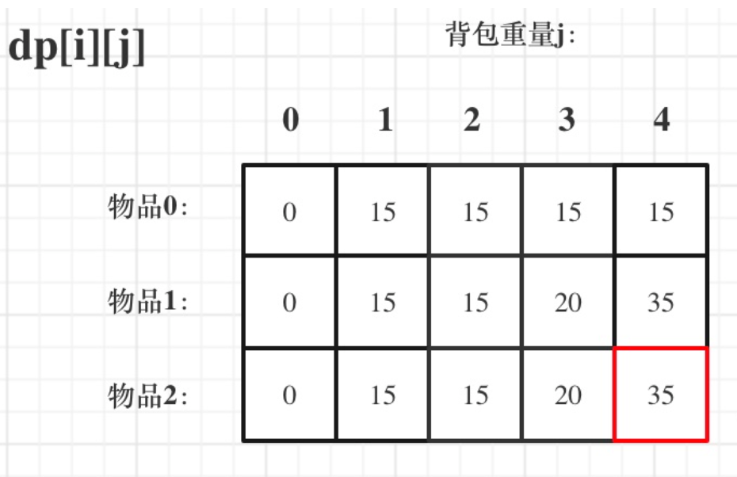

# 整数拆分

<https://leetcode.cn/problems/integer-break/>

```java
class Solution {
    public int integerBreak(int n) {
        //dp初始化
        int[] dp = new int[n+1];
        dp[2] = 1;
        if(n==2) return dp[2];
        for(int i = 3; i < n+1; i++) {
            for(int j = 1; j <= i-j;j++) {
                // 这里的 j 其实最大值为 i-j,再大只不过是重复而已，
                //并且，在本题中，我们分析 dp[0], dp[1]都是无意义的，
                //j 最大到 i-j,就不会用到 dp[0]与dp[1]
                dp[i] = Math.max(dp[i],Math.max(j*dp[i-j],j*(i-j)));
                // j * (i - j) 是单纯的把整数 i 拆分为两个数 也就是 i,i-j ，再相乘
                //而j * dp[i - j]是将 i 拆分成两个以及两个以上的个数,再相乘。
            }
        }
        return dp[n];
    }
}
```

# 不同的二叉搜索树

<https://leetcode.cn/problems/unique-binary-search-trees/>

```java
class Solution {
    public int numTrees(int n) {
        //设初值
        int[] dp  = new int[n+1];
        dp[0] = 1;
        dp[1] = 1;
        if(n==1) return dp[1];
        for(int i = 2; i < n+1; i++) {
            for(int j = 1; j <= i; j++) {
                    dp[i] += dp[j-1]*dp[i-j];
            }   
        }
        return dp[n];
    }
}
```

# 01背包

dp[i][j]   
i代表背包几，j代表价值或者重量

01背包先遍历背包和先遍历物品的结果是一样的



二维数组

```java
Class solution{
    int m = 3;  //物品数量
    int n  = 4; //背包重量
    int [] weight = {1,3,4};
    int [] value = {15,20,30};
    
    int[][] dp = new int[m][n];
    //初始化dp数组,java默认是0，所以要改的是第一列的某些值
        for(int j = weight[0];j<=n;j++) {
            dp[0][j] = value[0];
        }
    for(int i = 1;i < m; i++) {
       for(int j = 1;j<=n;j++) {
           //装不下,就等于之前的最大值    
           if(j < weight[i]) {
               dp[i][j] = dp[i-1][j];
        }else{  //装得下
               dp[i][j] = Math.max(dp[i-1][j],dp[i-1][j-weight[i]]+value[i]);
        }
       }
    }
    //dp[m-1][n] 
}
```

一维数组完成动态规划

```java
Class solution{
    int[] weight = {1,3,4};
    int[] value = {15,20,30};
    int bagWeight = 5;
    
    int [] dp = new int[weight.length];
    
    for(int i = 0; i <= weight.length-1; i++) {
        
    for(int j  = bagWeight; j >= weight[i]; j--){
        dp[j] = Math.max(dp[j],dp[j-weight[i]]+value[i]);
        }    
        
    }
    
    //dp[bagWeight]就是最大值
        }    
```

# 分割等和子集

<https://leetcode.cn/problems/partition-equal-subset-sum/>

```java
class Solution {
    public boolean canPartition(int[] nums) {
        /*
            背包大小为总和的一半
            满足一半就返回true
            物品价值为数的大小，物品的重量为数的大小

        */
        int sum = 0;
        for(int i = 0; i<nums.length;i++){
            sum+=nums[i];
        }
        if(sum % 2 != 0) return false;

        int sum2 = sum>>1;
        int [] dp = new int[sum2+1];
        for(int i = 0; i < nums.length; i++) {
            for(int j = sum2; j >= nums[i];j--){
                dp[j] = Math.max(dp[j],dp[j-nums[i]]+nums[i]);
            }
        }
        return dp[sum2] == sum2;
    }
}
```   

# 最后一块石头的重量Ⅱ

关键是尽可能分割成相等的两块

```java
class Solution {
    public int lastStoneWeightII(int[] stones) {
        //石头的重量就是价值   
        //石头只有放和不放   
    int size = stones.length;
    int sum = 0;
    for(int i = 0;i<size;i++){
        sum+=stones[i];
    }
    int target = sum/2;
    int[] dp = new int[target+1];
    //外层遍历价值
    for(int i = 0; i < size;i++) {
            //内层遍历背包,从大到小遍历
            for(int j = target; j>=stones[i];j--) {
                dp[j] = Math.max(dp[j],dp[j-stones[i]]+stones[i]);
            }
    }
      return sum-dp[target]-dp[target];
    }
}
```

# 目标和

<https://leetcode.cn/problems/target-sum/>    
解题思路： 首先是target由left组合-right组合求出

left - (sum - left) = target 可以推出 left = (target + sum)/2

回溯算法求解，超时

```java


```

