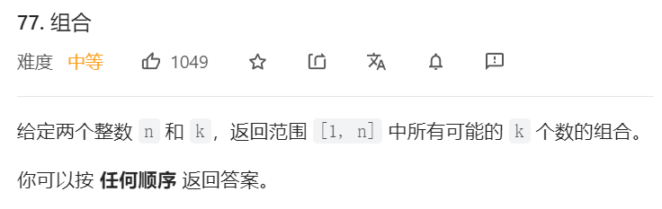
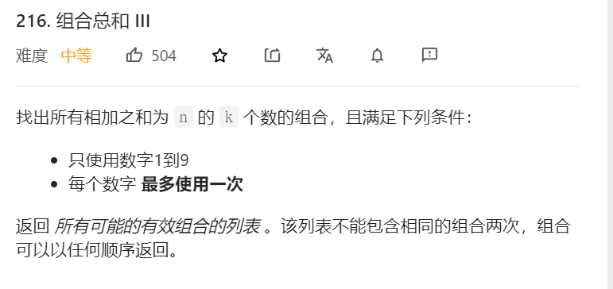
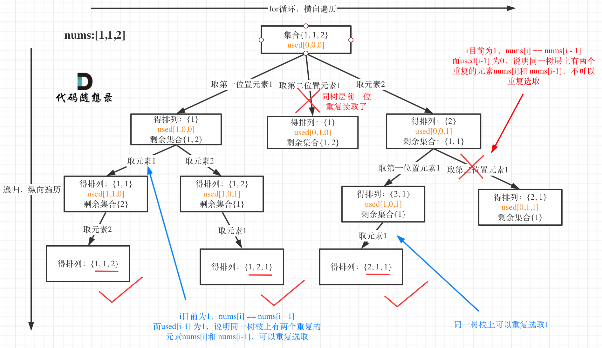

# 回溯解析   
回溯算法其实就是递归，有递归就有回溯，有回溯就有递归  

回溯法，一般可以解决如下几种问题：

* 组合问题：N个数里面按一定规则找出k个数的集合
* 切割问题：一个字符串按一定规则有几种切割方式
* 子集问题：一个N个数的集合里有多少符合条件的子集
* 排列问题：N个数按一定规则全排列，有几种排列方式
* 棋盘问题：N皇后，解数独等等


回溯可以理解为一棵树，for循环横向遍历，递归是纵向遍历，要得到答案和提高效率通常都是要剪枝和排除一些条件的
    

然后是回溯函数一般是用void类型，比如void backTracking(),参数边写边填，缺什么填什么    
下面是回溯的模板   
```java
void backtracking(参数) {
    if (终止条件) {
        存放结果;
        return;
    }

    for (选择：本层集合中元素（树中节点孩子的数量就是集合的大小）) {
        处理节点;
        backtracking(路径，选择列表); // 递归
        回溯，撤销处理结果
    }
}  
```

# 组合问题    

1. 最普通的组合     
    
```java
class Solution {
    LinkedList<Integer> list;
    List<List<Integer>> ans;

    public List<List<Integer>> combine(int n, int k) {
        list = new LinkedList<>();
        ans = new ArrayList<>();
        backTracking(n,k,1);
        return ans;
    }

    //num用来记录当前所在的位置   
    public void backTracking(int n,int k,int num) {
        //终止条件，数量够了就返回    
        if(list.size() == k) {
            ans.add(new ArrayList<>(list));
            return;
        }
        for(int i = num; i <= n-(k-list.size())+1; i++) {    
            //单层逻辑
            list.add(i);
            backTracking(n,k,i+1);
            //回溯
            list.removeLast();
        }
    }
}
```
这个题目涉及到剪枝问题， i <= n-(k-list.size())+1    
如果后序的个数不能凑成k个，就没必要继续下去了，换个角度看就是起始位置是多少的时候，才能凑齐      

2. 组合Ⅲ   
    
```java
class Solution {

    LinkedList<Integer> list;
    List<List<Integer>> ans;
    public List<List<Integer>> combinationSum3(int k, int n) {
        list = new LinkedList<>();
        ans = new ArrayList<>();
        backTracking(k,n,0,1);
        return ans;
    }


    public void backTracking(int k,int n,int sum,int startIndex) {
        //剪枝
        if(sum > n) {return;}        
        
        if(list.size() == k && sum == n) {
                ans.add(new ArrayList<>(list));
                return;
        }

        for(int i = startIndex;i<=9-(k-list.size())+1;i++) {  //剪枝

        //单层逻辑  
        list.add(i);
        sum+=i;
        backTracking(k,n,sum,i+1);
        //回溯
        list.removeLast();        
        sum-=i;
        }
        return;
    }
}
```


# 全排列Ⅱ 
涉及到去重问题，要先排序，这样就能用当前节点和前一个比较，如果相同就丢弃，不同的就添加     

    
