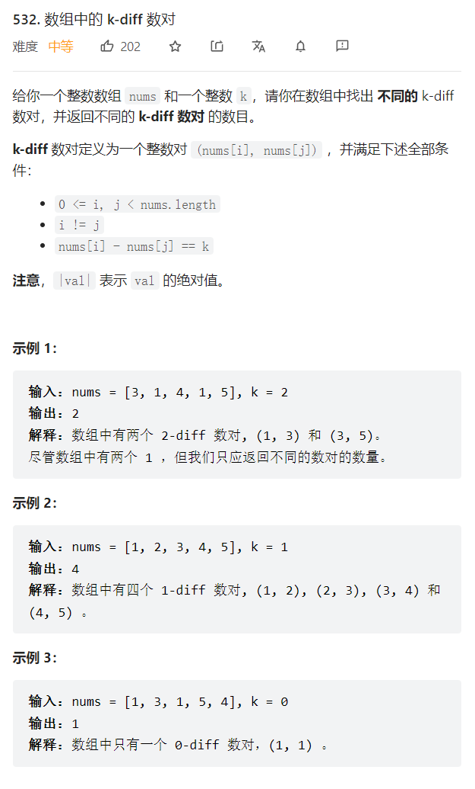

# 2022/6/16

   

```java
class Solution {
    public int findPairs(int[] nums, int k) {
        if(nums.length <= 1) return 0;
        Arrays.sort(nums);
        int right = 0;
        int res = 0;
        for(int left = 0; left < nums.length-1; left++) {
            //相同的元素直接跳过   
            if(left >= 1 && nums[left] == nums[left-1]) continue;
            right = left+1;
            while(right < nums.length) {
            //只要找到一个就进入下一次循环，继续下去也只能得到重复的答案   
             if((nums[right] - nums[left]) == k) {
                res++;
                break;
             }
            //剪枝,大于了说明右边不可能再有数满足这个k了   
            if(nums[right] - nums[left] > k) break;
            //没找到又<k就继续找   
            right++;
            }
        }
        return res;
    }
}
```


